# 医用电气设备 第 2-2 部分：高频手术设备及高频附件的基本安全和基本性能专用要求（Medical electrical equipment—Part 2-2: Particular requirements for the basic safety and essential performance of high frequency surgical equipment and high frequency surgical accessories）

(IEC 60601-2-2:2017, MOD)

2021-12-01 发布
2023-05-01 实施

## 前言

本文件按照 GB/T 1.1—2020《标准化工作导则 第1部分：标准化文件的结构和起草规则》的规定起草。

本文件是 GB 9706《医用电气设备》的第 2-2 部分。GB 9706 已经发布了以下部分：

- 第1部分：基本安全和基本性能的通用要求；
- 第1-3部分：基本安全和基本性能的通用要求 并列标准：诊断X射线设备的辐射防护；
- 第2-1部分：能量为1 MeV至50 MeV电子加速器基本安全和基本性能专用要求；
- 第2-2部分：高频手术设备及高频附件的基本安全和基本性能专用要求；
- 第 2-3 部分：短波治疗设备的基本安全和基本性能专用要求；
- 第 2-5 部分：超声理疗设备的基本安全和基本性能专用要求；
- 第 2-6 部分：微波治疗设备的基本安全和基本性能专用要求；
- 第2-8部分：能量为10 kV至1 MV治疗X射线设备的基本安全和基本性能专用要求；
- 第2-11部分：$\gamma$ 射束治疗设备的基本安全和基本性能专用要求；
- 第 2-12 部分：重症护理呼吸机的基本安全和基本性能专用要求；
- 第 2-13 部分：麻醉工作站的基本安全和基本性能专用要求；
- 第2-16部分：血液透析、血液透析滤过和血液滤过设备的基本安全和基本性能专用要求；
- 第 2-17 部分：自动控制式近距离治疗后装设备的基本安全和基本性能专用要求；
- 第 2-18 部分：内窥镜设备的基本安全和基本性能专用要求；
- 第 2-19 部分：婴儿培养箱的基本安全和基本性能专用要求；
- 第 2-24 部分：输液泵和输液控制器的基本安全和基本性能专用要求；
- 第 2-25 部分：心电图机的基本安全和基本性能专用要求；
- 第 2-26 部分：脑电图机的基本安全和基本性能专用要求；
- 第 2-27 部分：心电监护设备的基本安全和基本性能专用要求；
- 第 2-28 部分：医用诊断 X 射线管组件的基本安全和基本性能专用要求；
- 第 2-36 部分：体外引发碎石设备的基本安全和基本性能专用要求；
- 第 2-37 部分：超声诊断和监护设备的基本安全和基本性能专用要求；
- 第 2-39 部分：腹膜透析设备的基本安全和基本性能专用要求；
- 第 2-43 部分：介入操作 X 射线设备的基本安全和基本性能专用要求；
- 第2-44部分：X射线计算机体层摄影设备的基本安全和基本性能专用要求；
- 第 2-45 部分：乳腺 X 射线摄影设备和乳腺摄影立体定位装置的基本安全和基本性能专用要求；
- 第2-54部分：X射线摄影和透视设备的基本安全和基本性能专用要求；
- 第 2-60 部分：牙科设备的基本安全和基本性能专用要求；
- 第2-63部分：口外成像牙科X射线机基本安全和基本性能专用要求；
- 第 2-65 部分：口内成像牙科 X 射线机的基本安全和基本性能专用要求。

本文件代替 GB 9706.4—2009《医用电气设备 第 2-2 部分：高频手术设备安全专用要求》，与 GB 9706.4—2009 相比，除结构调整和编辑性改动外，主要技术变化如下：

- 增加了大电流模式的相关内容（见201.3.219、201.12.4.101）；
- 更改了“高频”的定义，增加了频率的上限（见201.3.220，见2009年版的2.12.108）；
- 增加了通用要求中应用条件、风险评估的相关内容（见201.4）；
- 增加了使用说明书的附加信息：神经肌肉刺激、非连续性启动、附件及电缆的最大允许长度的说明（见201.7.9.2.2.101）；
- 更改了手术附件高频漏电流的限值（见201.8.8.3.102，见2009年版的59.103.5）；
- 增加了手术附件绝缘中对高频漏电容的要求（见201.8.8.3.102）；
- 更改了中性电极电缆绝缘的高频漏电流限值（见201.15.101.4，见2009年版的59.104.4），增加了中性电极电缆绝缘中对高频漏电容的要求（见201.15.101.4）。

本文件使用重新起草法修改采用 IEC 60601-2-2:2017《医用电气设备 第 2-2 部分：高频手术设备及高频附件的基本安全和基本性能专用要求》。

本文件与 IEC 60601-2-2:2017 的技术性差异及其原因如下：

- 关于规范性引用文件，本文件做了具有技术性差异的调整，以适应我国的技术条件，调整的情况集中反映在201.2“规范性引用文件”中，具体调整如下：
  - 用等同采用国际标准的 GB 4824—2019 代替了 CISPR 11:2015；
  - 用修改采用国际标准的 YY 9706.102—2021 代替了 IEC 60601-1-2:2014；
  - 用修改采用国际标准的 YY 9706.108—2021 代替了 IEC 60601-1-8:2006；
  - 删除了 IEC 61000-4-3:2006，因未规范性引用；
  - 删除了 IEC 61000-4-6:2013，因未规范性引用。
- 更改了图 201.107，与图的文字表述相对应；
- 关于 EMC 相关内容，由于国内 YY 9706.102—2021 采用的是 IEC 60601-1-2:2007，本文件 202 和 AA.202 章条内容来源 IEC 60601-2-2:2009 中的 202 和 AA.202。

本文件做了下列编辑性修改：

- 参考文献中增加 IEC 60601-2-34:2011、GB/T 17626.3—2016、GB/T 17626.6—2017 和 CISPR 11；
- 删除了国际标准文本的术语索引。

请注意本文件的某些内容可能涉及专利。本文件的发布机构不承担识别专利的责任。

本文件由国家药品监督管理局提出并归口。

本文件及其所代替文件的历次版本发布情况为：

- 1992 年首次发布为 GB 9706.4—1992，1999 年第一次修订，2009 年第二次修订；
- 本次为第三次修订，文件编号改为 GB 9706.202—2021。

## 引言

医用电气设备安全标准也称为 9706 系列标准，由通用标准、并列标准、专用标准、指南和解释构成。

- 通用标准：医用电气设备应普遍适用的安全标准，即符合医用电气设备定义的设备均应满足此基础标准要求。
- 并列标准：医用电气设备应普遍适用的安全标准，但多数情况下仅限于具有某些特定功能或特性的设备才需要满足此类标准要求。
- 专用标准：某一类医用电气设备应适用的安全标准，且并非所有的医用电气设备都有专用标准。
- 指南和解释：对涉及的标准中相关要求的应用指南和解释说明。

GB 9706 系列标准中，除了已发布的标准和本文件之外，已列入计划的标准如下：

- 第 2-4 部分：心脏除颤器的基本安全和基本性能专用要求。目的在于建立心脏除颤器的基本安全和基本性能专用要求。
- 第 2-22 部分：外科、整形、治疗和诊断用激光设备的基本安全与基本性能专用要求。目的在于建立外科、整形、治疗和诊断用激光设备的基本安全和基本性能专用要求。
- 第 2-66 部分：听力设备及听力设备系统的基本安全和基本性能专用要求。目的在于建立了听力设备及听力设备系统的基本安全和基本性能专用要求。

本文件中规定的最低安全要求被认为在高频手术设备的操作中提供了安全实用度。

本文件修改和补充了 GB 9706.1—2020《医用电气设备 第1部分：基本安全和基本性能的通用要求》。

本文件中星号 $(\ast)$ 作为标题的第一个字符或段落或表格标题的开头，表示在附录AA中有与该项目相关的专用指南和原理说明。附录AA的相关内容不仅有助于正确地运用本文件，而且能及时地加快由于临床实践的变化或技术发展而修订标准的进程。

# 医用电气设备 第 2-2 部分：高频手术设备及高频附件的基本安全和基本性能专用要求

## 201.1 范围、目的和相关标准

除下述内容外，通用标准的第1章适用。

### 201.1.1 \* 范围

替换：

本文件适用于高频手术设备和高频附件的基本安全和基本性能。

额定输出功率不超过 50 W 的高频手术设备（如微型电凝器，或者用于牙科或眼科的设备）被排除于本文件的某些要求之外，这些排除会在相关要求中指明。

### 201.1.2 目的

替换：

本文件的目的是建立201.3.224和201.3.223中定义的高频手术设备和高频附件专用的基本安全和基本性能要求。

### 201.1.3 并列标准

增补：

本文件引用了通用标准的第2章和本文件201.2条款中所列适用的并列标准。

YY 9706.102 和 YY 9706.108 分别在第 202 章和第 208 章修改后适用。GB 9706.103、YY/T 9706.110 和 YY 9706.111 不适用。

### 201.1.4 专用标准

替换：

在 9706 系列标准中，专用标准可依据所考虑的专用 ME 设备，修改、替换或删除通用标准或并列标准中包含的要求，也可增补其他基本安全和基本性能的要求。

专用标准的要求优先于通用标准的要求。

在本文件中将 GB 9706.1—2020 称为通用标准。并列标准用它们各自的文件编号表示。

本文件中章和条的编号通过加前缀“201”与通用标准对应（例如，本文件中201.1对应通用标准第1章），或者通过加前缀“20x”与适用的并列标准对应，此处x是并列标准对应标准编号的末位数字（例如，本文件中202.6对应并列标准 YY 9706.102 中第6章的内容，本文件中208对应并列标准 YY 9706.108 中的内容，等）。

通过使用下列词语来规范对通用标准文本的变更：

“替换”即通用标准的章或条或适用的并列标准完全由本文件的内容所替换。

“增补”即本文件的内容作为通用标准或适用的并列标准的补充。

“修改”即通用标准的章或条或适用的并列标准由本文件的内容所修改。

作为对通用标准增补的条、图和表格从201.101开始编号。然而，由于通用标准中定义的编号从3.1至3.147，因此，本文件中增补的定义从201.3.201开始编号。增补附录的编号为AA、BB等，增补列项用aa）、bb)等表示。

对于增补到并列标准中的条、图或表从 20x 开始编号，此处“x”是并列标准对应编号的末位数字，例如 202 对应 YY 9706.102、208 对应于 YY 9706.108 等。

“本标准”是通用标准、任何适用的并列标准及本文件的统称。

若本文件中没有相对应的章和条，尽管可能不相关，通用标准或适用的并列标准中的章和条将无更改地适用。对通用标准或适用的并列标准中的任何部分，即使可能相关，若不采用，则本文件对其给出说明。

## 201.2 规范性引用文件

下列文件中的内容通过文中的规范性引用而构成本文件必不可少的条款。其中，注日期的引用文件，仅该日期对应的版本适用于本文件；不注日期的引用文件，其最新版本（包括所有的修改单）适用于本文件。

除下述内容外，通用标准的第2章适用。

替换：

YY 9706.102—2021 医用电气设备 第1-2部分：基本安全和基本性能的通用要求 并列标准：电磁兼容 要求和试验（IEC 60601-1-2:2007, MOD）

YY 9706.108—2021 医用电气设备 第1-8部分：基本安全和基本性能的通用要求 并列标准：通用要求，医用电气设备和医用电气系统中报警系统的测试和指南（IEC 60601-1-8:2012, MOD）

增补：

GB 4824—2019 工业、科学和医疗设备 射频骚扰特性 限值和测量方法 (CISPR 11:2015, IDT)

## 201.3 术语和定义

通用标准界定的以及下列术语和定义适用于本文件。

将“注1”替换为以下描述：

注 1：本文件中使用的术语“电压”和“电流”，除非另有说明，是指交流、直流或复合的电压或电流在 1 s 内的平均有效值。

增补：

### 201.3.201 手术附件 active accessory

预期由操作者使用，以在患者的预期部位由手术电极附近的电传导产生手术效果的高频附件，通常由手术手柄、手术附件的电缆、手术连接器和手术电极组成。

### 201.3.202 手术连接器 active connector

预期连接到手术输出端子的手术附件部件，可含有将一个指揿开关连接到一个开关检测器的一些附加端子。

### 201.3.203 手术电极 active electrode

使手术手柄延伸到手术部位并预期将高频电流传递到人体组织的手术附件的部件。

### 201.3.204 手术电极绝缘 active electrode insulation

固定在手术电极部件上的电气绝缘材料，预期用来防止对操作者或患者组织产生非预期的损伤。

### 201.3.205 手术手柄 active handle

预期由操作者手持的手术附件的部件。

### 201.3.206 手术输出端子 active output terminal

预期用于手术附件与高频手术设备或附属设备相连接并传递高频电流的部件。

注 1：手术连接器是指插入到手术输出端子的部件。

注 2：见图 AA.1。

### 201.3.207 \* 附属设备 associated equipment

与高频手术设备不同，但可同患者电路有电气连接的医用电气设备。

### 201.3.208 \* 双极 bipolar

在两个或多个手术电极之间向患者施加高频电流的方法，不需要单独连接中性电极（或使用患者身体作为对地电容），在一个或多个手术电极附近的组织中产生预期效果。

注 1：双极方法包括激励成对手术电极的装置以及激励成组手术电极的装置，其中高频电流的源极和返回极可具有不同数量的电极。

注 2：见图 AA.1 和图 AA.3。

### 201.3.209 双极附件 bipolar accessory

由同一支撑物上两个或多个手术电极组成的手术附件，在激励时，这种结构使得高频电流主要在这些电极之间流动。

### 201.3.210 凝（固） coagulation

使用高频电流引起热效应，例如，控制或防止出血，引起组织坏死，或引起组织收缩。

注 1：凝可以是接触（式）凝或者非接触（式）凝。

注 2：电灼、干燥、喷凝、强制凝、快速凝、软凝和氩气束（等离子）凝都是凝类型的名称。

### 201.3.211 接触质量监测器 contact quality monitor; CQM

高频手术设备或附属设备中，预期连接到可监测中性电极上，当中性电极与患者接触变差时提供报警的电路。

注：只有使用可监测中性电极时，接触质量监测器才能起作用。

### 201.3.212 连续性监测器 continuity monitor

高频手术设备或附属设备中，预期连接到一个中性电极的电路，当中性电极电缆或其连接器出现电气中断时提供报警。

### 201.3.213 \* 峰值系数 crest factor

高频手术设备输出开路状态下测量的峰值电压与有效值电压相除所得到的无量纲比值。

注：计算该值所需的正确测量方法可在附录 AA 中找到专门资料。

### 201.3.214 \* 切（割） cutting

利用手术电极上的高电流密度的高频电流使人体组织分开。

### 201.3.215 \* 以地为基准的患者电路 earth referenced patient circuit

患者电路中装有为高频电流到地提供的低阻通路的元件，如电容。

### 201.3.216 指揿开关 fingerswitch

通常是包含在一个手术附件内的装置，由操作者控制可启动高频输出，在释放时能禁止高频输出。注：预期不用作高频输出启动的类似开关要求还在考虑之中。

### 201.3.217 \* 电灼（面凝） fulguration

使用高频电流的，通过手术电极产生的电火花在组织表面产生一种效果，且手术电极不与组织物理接触。

### 201.3.218 \* 发热因子 heating factor

值等于 $I^2\times t$。

其中：

I——单极电流，单位安培（A）；

t——电流流动的持续时间，单位为秒（s）。

注 1：发热因子表示为 $\mathrm{A}^2\mathrm{s}$（安培平方秒）；

注 2：附加信息见附录 AA 对条款 201.15.101.5 的说明。

### 201.3.219 \* 大电流模式 high current mode

单极输出模式的预期用途（最大输出电流和最大持续周期）产生的发热因子在任何一个60 s周期内大于 $30\ A^{2}s$。

### 201.3.220 \* 高频 high frequency; HF

低于 $5\mathrm{MHz}$ 且通常高于 $200\mathrm{kHz}$ 的频率。

### 201.3.221 高频绝缘的患者电路 HF isolated patient circuit

没有安装为高频电流提供到地的低阻通路元件的高频患者电路。

### 201.3.222 高频患者电路 HF patient circuit

任何包含一个或多个患者连接的电路，包括高频手术设备和附属设备电路的所有导电部分，在正常状态或单一故障状态下，高频电流预期在 ME 设备和患者之间流动。

### 201.3.223 高频附件 HF surgical accessory

预期用于传输、补充或监测从高频手术设备向患者施加的高频能量的附件。

注 1：高频附件包括手术附件、和将它们连接到高频手术设备上去的电缆和连接器、中性电极，以及打算与高频手术患者电路相连接的其他附属设备。见图 AA.1。

注 2：并非所有用于高频手术设备的附件都是高频附件。

### 201.3.224 高频手术设备 HF surgical equipment

产生高频电流的医用电气设备，预期利用高频电流进行外科作业，如对生物组织切（割）或凝（固）。

注 1：高频手术设备也被称为外科透热设备、电外科手术设备、电外科手术发生器、射频发生器或高频发生器。

### 201.3.225 \* 高频手术模式 HF surgical mode

操作者可选择的一组高频输出特性中的任一种，预期在一个连接的手术附件上产生特定的效果，比如切、凝等的。

注：每一种可用的高频手术模式可配备一个操作者可调节的输出控制器，以设定希望的作用强度或速度。

### 201.3.226 \* 最大输出电流 maximum output current

<!-- 待核对：本定义正文在转换中丢失。以下文字按 201.3.227 的句式及附录 AA“条款 201.3.226”的原理说明补齐，请与标准原文核对。 -->

对于每一个可用的高频手术模式，在患者电路各连接（点）之间出现的最大可能峰值高频输出电流值。

### 201.3.227 \* 最大输出电压 maximum output voltage

对于每一个可用的高频手术模式，在患者电路各连接（点）之间出现的最大可能峰值高频输出电压值。

### 201.3.228 \* 可监测中性电极 monitoring NE

预期与接触质量监测器一起使用的中性电极。

注：可监测中性电极也被称为分裂极板、双极板、双箔电极或 CQM 电极。

### 201.3.229 \* 单极 monopolar

高频输出电流通过一个手术电极加到患者身体然后经一个分开的与患者连接的中性电极（或经患者身体对地电容）返回高频手术设备的方法。这种效果仅预期作用在手术电极处或附近的组织。

注：见图 AA.1 和图 AA.2。

### 201.3.230 中性电极 neutral electrode; NE

电极预期为高频电流的单极应用提供一个低电流密度的电气返回通道，以防止在患者组织中产生过高的温升或非预期的灼伤等效应。

注 1：中性电极还可称为极板、电极板、电外科垫、负电极、返回电极或分散电极。

注 2：为保持电流密度足够低以防止非预期的发热，中性电极需要有足够大的面积。

注 3：中性电极与患者接触的位置通常与单极手术电极的工作位置分开。

注 4：见图 AA.1 和图 AA.2。

### 201.3.231.1 额定附件电压 rated accessory voltage

〈单极高频附件〉相对于连接到患者的中性电极可施加的最大峰值高频输出电压。

### 201.3.231.2 额定附件电压 rated accessory voltage

〈双极高频附件〉可施加于一对相反极性电极的最大峰值高频输出电压。

### 201.3.232 额定负载 rated load

当高频手术设备每一种高频手术模式产生最大高频输出功率时的非电抗性负载电阻值。

### 201.3.233 额定输出功率 rated output power

对置于最大输出设定的每一种高频手术模式，当可同时启动的所有手术输出端子连接它们各自的额定负载时所产生的以“瓦”计的功率。

### 201.3.234 开关检测器 switch sensor

高频手术设备或附属设备的一部分，响应所连接的指揿开关或脚踏开关的操作来控制高频输出的启动。

## 201.4 通用要求

除下述内容外，通用标准的第4章适用。

增补：

#### 201.4.1.101 \* 应用的附加条件

高频手术设备对本文件的符合性以及高频附件对本文件的符合性应彼此独立，但性能试验的或制造商的特殊要求除外。

##### 201.4.2.3.101 \* 风险评估

制造商在其风险分析中应包含高频手术设备和/或高频附件在大电流模式下使用的可能性和这会对中性电极下发热的影响[例如，见201.7.9.2.2.101f)]。

### 201.4.3 \* 基本性能

增补：

201.8.4.101的第三个连字符中和201.12.4.101中所列的要求应被视为基本性能要求。

注：参考附录 AA。

### 201.4.7 ME 设备的单一故障状态

增补条款：

#### 201.4.7.101 特殊的单一故障状态

以下单一故障状态是本文件中特殊要求和测试的项目：

- a）可能引起不可接受的风险的连续性监测器或接触质量监测器故障（见201.8.4.101）；
- b) 引起过量低频患者漏电流的输出开关线路失效（见201.8.10.4.101.1）；
- c) 引起患者电路非预期激励的任何故障（见201.12.4.2.101）；
- d) 引起输出功率相对于输出设定明显增大的任何故障（见 201.12.4.4.101）。

### 201.4.11 输入功率

替换符合性试验中的第一个破折号：

- 高频手术设备应在输出模式下运行，并用负载使设备产生最大稳态输入电流。测量输入电流，并与标记和技术说明书的内容进行比较。

## 201.5 ME 设备试验的通用要求

除下述内容外，通用标准的第5章适用。

### 201.5.4 \* 其他条件

增补：

- aa）在测量高频输出时应特别注意保证精度和安全，其指南见附录AA。

### 201.6 ME 设备和 ME 系统的分类

通用标准的第6章适用。

## 201.7 ME 设备标识、标记和文件

除下述内容外，通用标准的第7章适用。

##### 201.7.2.8.2 其他电源

修改：

通用标准中7.2.8.2不适用于手术输出端子或中性电极端子。

#### 201.7.2.10 应用部分

增补：

防除颤应用部分标识要求的相关符号应附加到前面板上，不要求加到应用部分。

高频手术设备和附属设备上连接中性电极引线的连接（点）处应标明图201.101和图201.102中给出的符号：

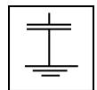

图 201.101 用于以地为基准的患者电路的符号

图 201.102 用于高频绝缘的患者电路的符号

增补条款：

##### 201.7.2.10.101 \* 高频附件

高频附件（高频附属设备除外）不应要求在附件本身、随机文件或包装上显示BF型或CF型标记，除非风险管理文档识别不可接受的风险与此排除相关。

#### 201.7.4.2 \* 控制装置

增补：

输出控制器应具有刻度和/或合适的指示器，用来表示高频输出的相对强度。指示器不应标有“瓦（W）”，除非在201.7.9.3.1中规定的整个负载电阻范围内，指示功率的精度偏差在±20%以内。

不应使用数字“0”，除非在这个位置时手术电极或双极附件释放的功率不超过 $10\mathrm{mW}$。

注：使用 201.12.1.102 的符合性试验验证。

#### 201.7.8.1 \* 指示灯颜色

将通用标准中的表2替换为表201.101。

**表 201.101 指示灯的颜色及其用于高频手术设备的含义**

| 颜色         | 含义                                           |
| ------------ | ---------------------------------------------- |
| 红色         | 警告——操作者需要立即响应，例如，患者电路故障 |
| 黄色         | 切模式                                         |
| 蓝色         | 凝模式                                         |
| 绿色         | 准备使用                                       |
| 任何其他颜色 | 除了红色、黄色、蓝色或绿色以外的含义           |

#### 201.7.8.2 \* 控制器颜色

与专用的高频手术模式相关的操作控制器、输出端口、指示灯、踏板（见201.12.2）和指揿开关按钮（见201.12.2）应以与表201.101不冲突的、一致的、唯一的颜色加以识别。

通过检查来检验是否符合要求。

##### 201.7.9.2.2 警告和安全须知

增补条款：

###### 201.7.9.2.2.101 使用说明书的附加信息

附加信息如下：

- 使用高频手术设备的注意事项。这些事项应引起操作者对某些预防措施的注意，这些预防措施对于减少意外灼伤风险是必要的。如果适用，应特别给出以下忠告：

  - 中性电极整个面积宜可靠贴合到由制造商定义的经适当准备的患者身体合适区域。
  - 患者不宜接触接地的或对地具有可观电容的金属物（如：手术台支架等）。
  - 要防止皮肤对皮肤（如患者肢体之间）的接触，譬如插入干纱布。
  - 在同一患者身上同时使用高频手术设备和生理监护设备时，任何监护电极宜尽可能远离高频电极，不宜使用针状监护电极。在所有情况下，宜使用带有高频电流限制装置的监护系统。
  - 放置患者导联时要防止其与患者或其他引线相接触。暂时不用的手术电极要存放于与患者隔离的地方。
  - 对于高频电流可能流经人体较小横截面积部分的外科手术，最好使用双极技术，可防止非预期的组织损伤。
  - 对于预期效果，要选择尽可能低的输出功率。某些装置或附件在低功率设定下可出现不可接受的风险。例如：在使用氩气束凝时，如果高频功率不足以使目标组织上产生一个快速封闭的痂面，则气栓风险就可能出现。
  - 对于在正常操作设定下正确运行的高频手术设备，当出现输出降低或中断时，可表示中性电极不正确应用或连接器接触不良。因此，在选择更高输出功率之前，要检查中性电极及其连接器的应用情况。
  - 如果在胸部或头部范围进行电外科手术，要防止使用可燃性麻醉剂和氧化性气体，如笑气 $\left(\mathrm{N}_{2}\mathrm{O}\right)$ 和氧气，除非（手术前）将这些试剂吸除。
    如有可能，宜使用不可燃试剂来清洗和消毒。
    宜用可燃性试剂来清洗和消毒或用作为粘接剂的溶剂，但在高频手术进行之前要蒸发掉这些试剂。患者身体或凹槽如脐眼以及腔孔（如阴道）存在积聚可燃性试剂风险。在使用高频手术设备之前，宜将任何积聚的液体擦除干净。（还）要注意体内气体点燃危险。某些材料如棉花、毛料和纱布，当充满氧气时，可被高频手术设备正常使用时产生的火花所点燃。
  - 对于携带电气导电植入物的患者，由于高频电流的集中或重新定向，存在可能的危险。如有疑问，要给出有效的建议。
  - 对于具有 201.12.2 c)2) 所述工作模式的高频手术设备，应给出相互影响的警告：来自另一个手术电极的输出在使用中可能改变。
- 警告：高频手术设备运行时产生的干扰可能对其他电子设备的运行有不利影响。对于携带心脏起搏器或其他有源植入物的患者，可能存在危险，因为可能会产生对有源植入物工作的干扰，或者损坏有源植入物。如有疑问，要给出有效的建议。
- *对于高频手术设备，每一种高频手术模式的最大输出电压和关于额定附件电压的说明如下：

  - 在最大输出电压 $(U_{\mathrm{max}})\leqslant 1600\mathrm{V}$ 情况下，应给出说明，附属设备和手术附件宜选用的额定附件电压 $\geqslant$ 最大输出电压。
  - 在最大输出电压 $(U_{\mathrm{max}})>1\ 600\ \mathrm{V}$ 情况下，用公式计算变量y：

    $y=\frac{U_{\max}-400[V]}{600[V]}$ 取变量 y 或 6 中较小者。如果计算结果 $y\leqslant$ 该高频手术模式的峰值系数，应给出说明，附属设备和手术附件宜选用的额定附件电压 $\geqslant$ 最大输出电压。
  - 在最大输出电压 $(U_{\mathrm{max}}) > 1600\mathrm{V}$ 情况下，且峰值系数 $<$ 上面计算的变量 $y$，要给予警告：在这种模式或设定下使用的任何附属设备和手术附件，其额定容量应能够耐受实际电压和峰值系数的组合应力。

  如果最大输出电压随输出设定而变，则应以图形给出作为输出设定函数的电压值资料。
- 警告：高频手术设备的故障会引起输出功率非预期的增大。
- *同专用的可监测中性电极相容性说明。
  警告：如不使用相容的可监测中性电极，在中性电极与患者之间失去安全接触时，接触质量监测器是不会产生听觉报警的。
  注 1：该要求不适用于仅配置双极输出的高频手术设备。
  注 2：该要求不适用于预期不使用中性电极的高频手术设备。（见201.15.101）。
- 在预期的或可预见的使用过程中，中性电极下的温度可能超过通用标准中 11.1.2.2 或本文件中 201.15.101.5 所列限值，应提供正确使用中性电极的说明、警告和注意事项。
- *针对神经肌肉刺激引起的风险的警告，特别是能在手术电极和组织之间引起电弧的模式。
- *按照 201.8.10.4.101.2，能被未持续激活的开关检测器激励的高频手术设备，有关风险的警告或注意事项。
- *对于高频手术设备，每种连接器类型的附件及其电缆的最大允许长度。
  注 3：附加信息见附录 AA。

##### 201.7.9.2.14 \* 附件、附加设备、使用的材料

增补：

使用说明书应包括：

- a）应包含有选择和使用高频附件的资料，以防止不兼容和不安全操作（还可见201.15.4.1.101和201.15.4.1.102）。
- b) 应告知操作者：要防止高频输出设定使最大输出电压超过额定附件电压。
- c）应告知有关可监测中性电极和接触质量监测器的兼容性。
- d) 建议操作者定期检查附件，特别是：电极电缆和高频能量内窥镜治疗设备（见 GB 9706.218）使用的附件要检查（例如，在放大时）其可能的损坏。
- e) * 对于附属设备和手术附件包括单独提供的它们的零部件，要给出额定附件电压，及仅用于高频手术模式输出设定产生的峰值输出电压不高于额定附件电压的警告。
- f) * 关于中性电极有效期的包装：

  - 如标有一次性使用，则要标上有效期；
  - 防止中性电极部位灼伤的必要信息，例如输出设定的限制、患者准备或启动时间；
  - 如仅打算用于小患者，则要标以千克（kg）数，以指明预期使用的患者最大体重。（见201.15.101.5）
- g）*关于使用可监测中性电极的说明：

  - 说明其同专门的接触质量监测器的相容性。
- h) 在预期的或可预见的使用过程中，使用中性电极时高频附件的温度可超过通用标准中11.1.2.2或本文件中201.15.101.5所列限值，应提供正确使用中性电极的说明、警告和注意事项。
- i) 预期仅与特定的高频手术设备、高频波形或电压配合使用的高频附件的使用说明书中，提供这种影响的详细说明。
- j）*对于手术电极和手术手柄，评估以下危险情况的信息：

  - 手术电极杆与手术手柄连接处可见的外露金属；
  - 手术手柄和手术电极杆之间电气连接不良；
  - 手术手柄和手术电极杆之间配合不良。

注：附加信息见附录 AA。

##### 201.7.9.2.15 环境保护

增补：

使用说明书应向操作者提供有关适当使用烟雾抽吸的建议。

#### 201.7.9.3 技术说明书

201.7.9.3.1 * 概述

增补：

- 功率输出数据——单极输出（对于所有可用的高频手术模式，任何可调的“混切”控制器设定在最大位置）包括：
- 表示全输出控制设定和半输出控制设定下，在负载电阻范围至少为 $100\Omega \sim 2000\Omega$ 的功率输出关系图，必要时这个电阻范围应扩展以包含额定负载。
- 表示在上述负载范围内一个规定负载电阻上的功率输出对输出控制设定的关系图。
- 功率输出数据——双极输出（以上定义的所有高频手术模式）包括：
- 表示全输出控制设定和半输出控制设定下，在负载电阻范围至少为 $10\Omega \sim 1000\Omega$ 的功率输出关系图，必要时这个电阻范围应扩展以包含额定负载。
- 表示在上述负载范围内一个规定负载电阻上的功率输出对输出控制设定的关系图。
- 电压输出数据——单极和双极输出（对所有可用的高频手术模式）。按201.7.9.2.2.101 c)要求的最大输出电压数据。
- 如果规定高频手术设备不带中性电极使用，对此应加以说明。
- 如果高频手术设备或附属设备设计成只具有单一的、固定的输出设定，那么就可略去所述“半输出控制设定”。
- 每个高频手术模式的最大输出电流。
- 当高频手术设备在任何大电流模式下使用时，在任意 $60\mathrm{s}$ 周期内产生的最大发热因子。

## 201.8 ME 设备对电击危险的防护

除下述内容外，通用标准的第8章适用。

### 201.8.4 电压、电流或能量的限制

增补条款：

#### 201.8.4.101 \* 中性电极监测电路

具有中性电极连接点的高频手术设备应配置以下一个或多个：

- 连续性监测器；
- 接触质量监测器；
- 确保在使用中性电极时不出现不可接受的温升的一种替代方法（见201.15.101.5）。任何替代方法应被视为基本性能。

如201.8.6.1中所述，高频手术设备不使用中性电极的情况下，这些可停用。

当中性电极回路、它的连接器、或替代方法发生故障时，应配置这些使单极输出停激并发出可听报警。可听报警应满足201.12.4.2.101的声级要求并且不应在外部调节。使用不可监测中性电极时，接触质量监测器可停用。该选择应明显地指示给操作者。在这种情况下，采用连续性监测器或一种替代方法以保证在使用中性电极时不出现不可接受的温升的要求应仍然适用。

注 1：在本条中，连词“或”的使用是包容性的，可表示第一选择、第二选择，或两者。

注 2：这种可听报警和可见指示灯不适用 YY 9706.108—2021 中报警信号的定义。还可见本文件第 208 章。

监测电路应由与网电源部分和地相隔离的且电压不超过 12 V 的电源供电。接触质量监测器的监测电流的限值已在 201.8.7.3 中规定。

应提供一个由红色指示灯构成的附加可见报警（见201.7.8.1）。

将高频手术设备接入图 201.103 所示电路，在各种工作模式最大输出控制设定下运行，来检验连续性监测器是否符合要求。图中开关闭合和打开各 5 次，开关每次打开时，高频输出应被禁止且发出报警声响。

接触质量监测器符合性试验：接通高频手术设备的网电源，并设置其控制器于单极工作模式，但不应启动。然后按201.7.9.2.2.101 e)的建议选择一个合适的可监测中性电极连接到接触质量监测器的中性电极连接器上。

再按使用说明书所述方法放置中性电极，使之完全同人体目标或合适代用品表面接触，接触质量监测器如说明书规定进行设置，然后启动高频手术设备的一个单极高频手术模式，此时应无报警声，且有高频输出；让高频手术设备处于启动状态，逐渐减少中性电极和人体目标或合适代用品表面之间的接触面积直到中性电极出现报警。应记下剩余的接触面积（报警面积）$A_{\mathrm{a}}$，以便接下来按201.15.101.5进行温升试验，并且当尝试启动时应无高频输出产生。

用至少三只合适的可监测中性电极样品在两个轴向上重复这个试验。

通过评审制造商的文件和风险管理文档来检验替代方法的符合性，以确保使用中性电极时不出现不可接受的温升。

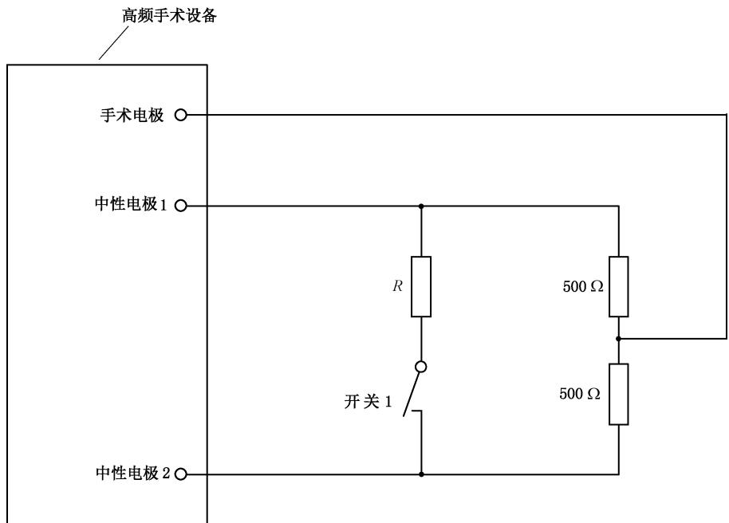

注：

单片极板：$R=0\ \Omega$。

分裂极板：R 由制造商这样来规定，它刚好使设备在开关 1 闭合时保持启动。

分裂成两部分以上的中性电极宜进行相应试验。

图 201.103 适用于 201.8.4.101 符合性试验的电路

#### 201.8.4.102 \* 神经肌肉刺激

为了使神经肌肉刺激的可能性降到最低程度，患者电路中应装入电容，使之有效地与手术电极或双极附件的一个导体相串联。这个电容在单极患者电路中应不超过 5 nF，在双极患者电路中应不超过 50 nF。在手术电极和中性电极端口之间，或者在双极输出电路的两个端口之间的直流电阻应不小于2 MΩ。

通过检查线路布局和测量输出端之间的直流电阻来检验是否符合要求。

##### 201.8.5.1.2 \* 对患者的防护措施（MOPP）

修改：

对于高频手术设备，在高频应用部分与包括信号输入/输出部分在内的外壳之间、高频患者电路和中间电路之间以及不同高频患者电路之间，其爬电距离和电气间隙应至少为 $3\mathrm{mm / kV}$ 或 $4\mathrm{mm}$，取其较大值。基准电压应是最大峰值电压。这些隔离不需要经受201.8.8.3的电介质强度测试。

在本条款的上下文中，高频手术设备的高频患者电路应视为应用部分。

爬电距离和电气间隙是用来代表两种防护措施。

这个要求不适用于那些能够证明具有足够等级的元器件，例如被元件制造商提供的参数或201.8.8.3中电介质强度试验所证明的元器件。

该要求不适用于高频附件。高频附件的要求和试验见201.8.8.3和201.15.101.4。

##### 201.8.5.2.3 \* 患者导联或患者电缆

修改：

该要求应不适用于手术连接器或任何中性电极连接器，以下详细说明除外。

对于中性电极电缆，远离患者的连接器的结构应使其连接不能接触固定的网电源插座或网电源连接器的导体带电部分。

如果所述连接器导电性接头能插入一个固定的网电源插座插孔或网电源连接器中，则应用至少具有爬电距离 1.0 mm，电介质强度 1500 V 的绝缘来防止该接头与带有网电源电压的部分接触。

通过对以上连接器的导电性连接部分检查和电介质强度试验来检验是否符合要求。

#### 201.8.5.5 \* 防除颤应用部分

修改：

在本条款范围内，高频手术设备的高频患者电路应被看作应用部分。

仅用通用标准8.5.5.1和图9所述共模试验来检验其符合性，所用试验电压以 $2\mathrm{kV}$ 替代 $5\mathrm{kV}$。

试验后，高频手术设备应能满足本文件的所有要求和试验，并且能执行随机文件中所述预期功能。

#### 201.8.6.1 \* 要求的适用性

增补：

一般情况下，保护接地导线不应携带功能性电流。但是对于额定输出功率不超过50 W且预期不带中性电极使用的高频手术设备，网电源电缆中的保护接地导线可用作功能性高频电流的返回通道。

#### 201.8.7.1 \* 通用要求

- b)

  增补：

  以高频输出不工作，但不影响低频漏电流的方式试验。

  修改：

  这些试验应以高频手术设备电源接通而患者电路不启动的方式进行。

#### 201.8.7.3 \* 容许值

- b)

  增补：

  与接触质量监测器相关的患者辅助电流，不应超过BF型应用部分的允许值。

  修改：

  10 mA 漏电流限制不适用于患者电路被启动时从手术电极和中性电极测试的高频漏电流（见 201.8.7.3.101）。

  增补条款：

##### 201.8.7.3.101 高频漏电流的热作用

为了防止非预期的热灼伤，高频患者电路启动时从手术电极和中性电极测试的高频漏电流，根据其设计，应符合下列要求。

- **a) \*高频漏电流**

  对于高频漏电流的所有测量，Ⅱ类高频手术设备和内部供电高频手术设备的任何金属外壳应接地。在进行该试验时，具有绝缘外壳的高频手术设备，应放在面积至少等于高频手术设备底板的接地金属（板）上。

  在高频漏电流的所有测量中，高频手术设备的电源软电线应折扎成长度不超过 $40~\mathrm{cm}$ 的线束。
- **1) 单极以地为基准的患者电路**

  患者电路对地绝缘，但中性电极利用一些元件（如电容）使其在高频下以地为基准，并能满足BF型应用部分要求。当以下述方法试验时，从中性电极经一个 200 Ω 无感电阻流向地的高频漏电流不应超过 150 mA。

  用下面的试验来检验是否符合要求：

  试验 1：依次对带有如图 201.104 所示的电极电缆和电极的高频手术设备的每一个输出进行试验。两电缆间隔为 0.5 m，置于离接地导电平面上方 1 m 的绝缘表面上。

  输出端带 $200\Omega$ 负载，高频手术设备每一个工作模式以最大输出设定运行，测量从中性电极经 $200\Omega$ 无感电阻流向地的高频漏电流。

  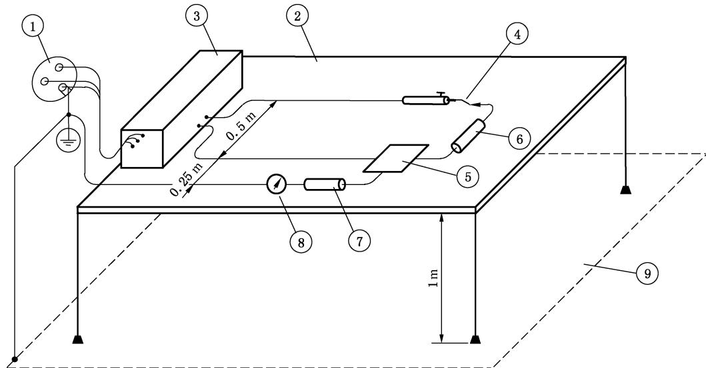

  标引序号说明：

  ①——供电网；

  ②——绝缘材料制作的台板；

  ③——高频手术设备；

  ④——手术电极；

  ⑤——中性电极、金属或与同样尺寸的金属箔相接触；

  ⑥——负载电阻 200 Ω；

  ⑦——测试电阻 200 Ω；

  ⑧——高频电流表；

  ⑨——接地的导电平面。

  图201.104 以地为基准的患者电路和电极之间加载时的高频漏电流的测量

  试验 2：高频手术设备如试验 1 布置，但 $200 \Omega$ 负载电阻接在手术电极和高频手术设备的保护接地端子之间，如图 201.105 所示，测量从中性电极流出的高频漏电流。

  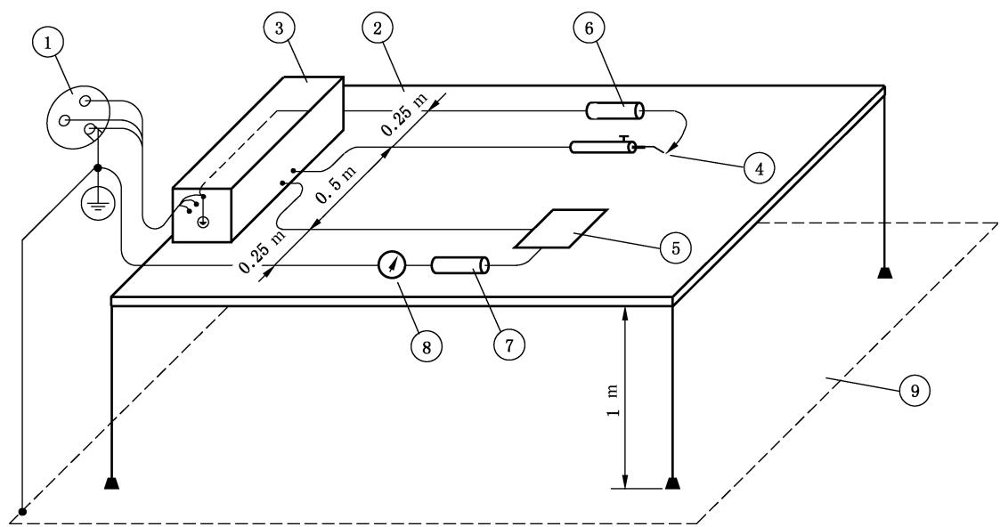

  标引序号说明：

  ①——供电网；

  ②——绝缘材料制作的台板；

  ③——高频手术设备；

  ④——手术电极；

  ⑤——中性电极、金属或与同样尺寸的金属箔相接触；

  ⑥——负载电阻 200 Ω；

  ⑦——测试电阻 $200 \Omega$；

  ⑧——高频电流表；

  ⑨——接地的导电平面。

  图201.105 以地为基准的患者电路和手术电极到地加负载电阻时的高频漏电流的测量
- **2) 单极高频绝缘患者电路**

  无论在高频还是在低频下，患者电路均对地绝缘，并且这种绝缘在进行下述试验时，每一个电极依次经 $200 \Omega$ 无感电阻流向地的高频漏电流不应超过 150 mA。

  用下述试验来检验是否符合要求。

  高频手术设备如图201.106所述布置，输出不加载或加额定负载。

  在高频手术设备每一个高频手术模式最大输出设定下依次测量每一个电极的高频漏电流。

注 1：以上 1) 和 2) 的要求不适用于额定输出功率不超过 50 W 且预期不带中性电极使用的高频手术设备。

  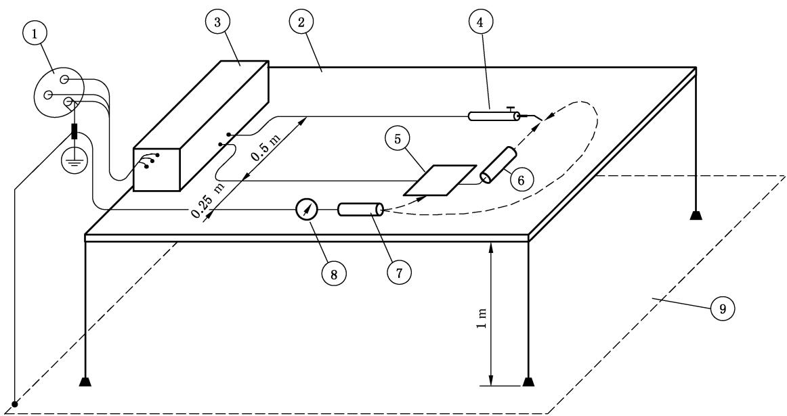

  标引序号说明：

  ①——供电网；

  ②——绝缘材料制作的台板；

  ③——高频手术设备；

  ④——手术电极；

  ⑤——中性电极、金属或与同样尺寸的金属箔相接触；

  ⑥——额定负载；

  ⑦——测试电阻 200 Ω；

  ⑧——高频电流表；

  ⑨——接地的导电平面。

  图201.106 高频绝缘患者电路的高频漏电流的测量

- **3) \*双极高频患者电路**

  专门设计作双极应用的患者电路，无论在高频还是低频下，都应与地及其他应用部分绝缘。在所有输出控制设定为最大值时，从双极输出的任一极经 $200\Omega$ 无感电阻到地和到中性电极流通的高频漏电流，在 $200\Omega$ 无感电阻上形成的功率不应超过最大双极额定输出功率的 $1\%$。用下面的试验来检验是否符合要求：

  高频手术设备如图 201.107 所述布置，用制造商提供或建议的双极和中性电极（如适用）引线对双极输出的一个电极端进行试验。输出端先不加载然后再加额定负载重复试验。测得的电流平方乘上 $200 \Omega$ 应不超出上面的要求。最后再对双极输出的另一电极端重复以上试验。

注 2：以上1)、2)和3)的要求对具有BF型和CF型应用部分的高频手术设备均适用。

  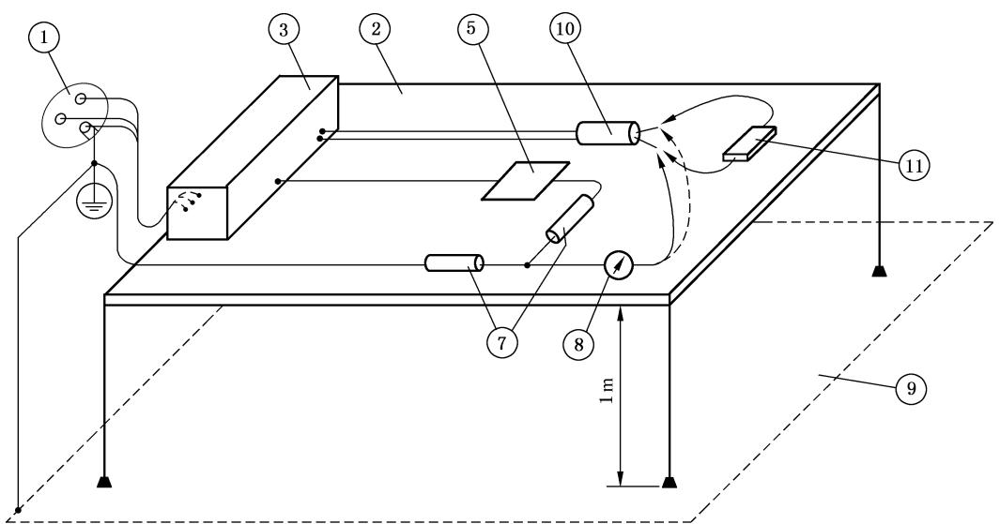

  IEC 1198/06

  标引序号说明：

  ①——供电网；

  ②——绝缘材料制作的台板；

  ③——高频手术设备；

  ⑤——中性电极、金属或与同样尺寸的金属箔相接触；

  ⑦——测试电阻 $200 \Omega$；

  ⑧——高频电流表；

  ⑨——接地的导电平面；

  ⑩——启动的双极附件；

  ⑪——负载电阻，如要求，可带高频功率测量装置。

  图201.107 通过双极附件的高频漏电流的测量

- **b) \*直接在高频手术设备端口测量的高频漏电流**

  当直接在高频手术设备端口测量高频漏电流时，前面的试验项目a)也可通过将1)和2)的限值改变为 $100\mathrm{mA}$，而3)的在 $200\Omega$ 上的双极额定输出功率的 $1\%$ 的限制不变，且不得超过 $100\mathrm{mA}$ 来替代。

  用类似于201.8.7.3.101a)所述的试验的测量方法来检验是否符合要求，但不带电极电缆，试验中用于将负载电阻、测试电阻和电流测量仪表连接到高频手术设备上去的引线要尽可能短。
- **c) 不同高频患者电路之间的横向耦合**

  当其他患者电路以所有可用工作模式和在最大输出设定下启动时，那么：
- 1）一个未启动的单极患者电路分别经 $200\Omega$ 负载到地和到中性电极均不应产生 $150\mathrm{mA}$ 以上高频电流。
- 2）一个未启动的双极患者电路在跨接于两输出端上的 $200\Omega$ 负载上不得产生 $50~\mathrm{mA}$ 以上高频电流；两输出端子短接后，经 $200\Omega$ 负载到地以及经 $200\Omega$ 负载到中性电极不应产生 $50~\mathrm{mA}$ 以上的高频电流（两电流相加，参见图201.107）。用201.8.7.3.101b)条款中所述试验安排和如图201.106（单极）或图201.107（双极患者电路）所示的高频手术设备布置进行测量来检验是否符合要求。

#### 201.8.8.2 固体绝缘的穿透距离或薄层材料的使用

修改：

通用标准中 8.8.2 a) 和 8.8.2 b) 的要求不适用于高频附件。

#### 201.8.8.3 电介质强度

修改：

这些要求不适用于高频附件。对高频附件的要求和试验在201.8.8.3.101和201.15.101.4中给出。增补试验条件：

- aa）如果在对固体绝缘形式的患者防护措施进行绝缘强度试验时，在通用标准8.9和本文件的201.8.5.1.2中规定的电气间隙上经大气产生击穿或闪络，可插入一绝缘层来防止这种击穿，因此经保护的绝缘就能试验了。

<!-- 待核对：bb) 在 PDF 转换中断裂缺失（上句止于“和本文件”，下段另起“如变压器…”），请对照标准原文补全，勿据 aa) 推测填写。 -->

- bb) 如果在对固体绝缘形式的患者防护措施进行绝缘强度测试时，在通用标准 8.9 和本文件

  如变压器、继电器、光电耦合器或印刷电路板上的爬电距离等进行试验。

  增补条款：

##### 201.8.8.3.101 \* 手术附件绝缘

手术附件及手术附件的电缆应有足够的绝缘，以减轻正常使用时对患者和操作者非预期热灼伤风险。

通过以下试验来检验是否符合要求：

无一次性使用标记的试样应已经过清洁、消毒和灭菌，这些方法采用的循环次数按使用说明书中的规定。见通用标准7.9.2.12。

除手术手柄和手术连接器之外的所有手术附件绝缘部分，应浸入 $0.9\%$ 盐水中进行预处理 $12\mathrm{h}$。在试验制备中剥露的工作导体以及手术附件的电缆端部 $100\mathrm{mm}$ 范围内的绝缘应防止接触盐水，一旦完成这个预处理程序，应用抖、甩的方法和/或用干纱布揩擦，将表面和孔腔中过多的盐水去除。

在盐水预处理后立即按以下顺序进行合适的电气试验：

- 高频泄漏（201.8.8.3.102）；
- 高频电介质强度（201.8.8.3.103）；
- 工频电介质强度（201.8.8.3.104）。

##### 201.8.8.3.102 \* 手术附件的高频泄漏

手术附件的高频泄漏测量按下述要求进行：

- a）测量高频漏电流

  应用于手术附件的绝缘，包括手术电极绝缘，但不包括手术连接器，应限制绝缘外表面上流通的高频漏电流小于 $I_{\text{漏}}$；

  预期用于单极应用的手术附件的限值为：

  $$
  I_{\text{漏}}[\mathrm{mA}] = 2.0 \times 10^{-5} \times d \times L \times f_{\text{试}} \times U_{\mathrm{p}}
  $$

  式中：

  d ——绝缘的最小外径，单位为毫米（mm）；

  L ——流通高频漏电流的样品绝缘长度，单位为厘米（cm）；

  $f_{\text{试}}$ ——高频试验电压频率，单位为千赫（kHz）；

  $U_{p}$ ——峰值高频试验电压，单位为伏（V）。

  预期用于双极应用的手术附件的相应限值为：

  $$
  I_{\text{漏}}[\mathrm{mA}] = 4.0 \times 10^{-5} \times d \times L \times f_{\text{试}} \times U_{\mathrm{p}}
  $$

  通过以下试验来检验是否符合要求：

  在整个试验过程中，除了离两端剥露导体各 $1\mathrm{cm}$ 绝缘之外，试样绝缘的全部长度（不超过 $30~\mathrm{cm})$ 应浸入 $0.9\%$ 盐溶液中或者包扎于浸过盐溶液的透水布中。所有工作内导体应一起连接于一个高频电压源的一个极上，该电压源具有频率 $f_{\text{试}}$ 为 $300\mathrm{kHz}$ 到 $1\mathrm{MHz}$ 的近似正弦波形。高频电压源的另一极接到一个导电电极上，该电极浸于盐溶液中或者接到包扎于浸过盐溶液的透水布中段的金属箔上，用合适仪表串接在高频电压源输出中，监测高频漏电流 $I_{\text{漏}}$。在高频电压源两输出极上监测高频试验电压 $U_{\mathrm{p}}$。

  提升高频试验电压 $U_{\mathrm{p}}$，直到峰值电压等于额定附件电压或 $400\mathrm{V}$ 两个值中的较小值，测得的高频漏电流 $I_{\text{漏}}$ 不应超过规定限值。
- **b) 测量高频漏电容**

  上述 a) 项或者可通过限制测量到的预期用于单极应用的手术附件的高频漏电容实现，高频漏电容不超过：

  $$
  C_{\text{漏}}[\mathrm{pF}] = 4.4 \times d \times L
  $$

  对于预期用于双极应用的手术附件，高频漏电容不超过：

  $$
  C_{\text{漏}}[\mathrm{pF}] = 8.8 \times d \times L
  $$

  式中：

  d ——绝缘的最小外径，单位为毫米（mm）；

  L ——浸入盐溶液中的样品绝缘长度，单位为厘米（cm）。

  测量的高频漏电容不得超过规定的相关限值。

  通过以下试验来检验是否符合要求：

  在整个试验过程中，除了离两端外露导体各 1 cm 绝缘之外，试样绝缘的全部长度（不超过 30 cm）应浸入 0.9% 盐溶液中或者包扎于浸过盐溶液的透水布中。

  所有工作内导体应一起连接于一个感应频率为 $100 \, kHz$ 至 $1 \, MHz$ 的电容测量仪器的一个测量端。

  电容测量仪器的另一测量端连接到导电电极上，该电极浸于盐溶液中或者接到包扎于浸过盐溶液的透水布中段的金属箔上。

  按照仪器制造商的推荐方法操作，电容测量仪器指示的电容即高频漏电容。

##### 201.8.8.3.103 \* 手术附件的高频电介质强度

手术附件所用绝缘应能承受1.2倍额定附件电压的高频电压。

通过以下试验来检验是否符合要求：

应在与额定附件电压（由高频附件制造商在使用说明书中规定[见 201.7.9.2.14 e)]）相关联的一个电压下进行试验，该试验电压如以下试验方法中所详述。对于手术电极和手术附件电缆，经盐水预处理过的绝缘部分，在不损坏试样外表情况下，用一段直径为 $0.4\mathrm{mm}(1\pm 10\%)$ 裸导线以节距至少为 $3\mathrm{mm}$，在电缆绝缘上最多绕5圈。如有必要防止意外弧光放电，该裸导线与手术电极工作导体部分之间的爬电距离可用绝缘来增加到 $10\mathrm{mm}$。附加绝缘的厚度不应超过 $1\mathrm{mm}$，并且覆盖到手术电极绝缘上的附加绝缘不应超过 $2\mathrm{mm}$。高频试验电压源的一个极应连接到试验用裸导线上，另一个极应连接到被试样品的所有工作导体上。

手术手柄连同任何可拆卸电缆和可拆卸手术电极，按规定组合在一起，用在 $0.9\%$ 盐溶液中浸泡过的透水布包起来，整个手柄外表面应包覆，包布应延伸到电缆表面至少 $150~\mathrm{mm}$，延伸到手术电极绝缘至少 $5\mathrm{mm}$。如果必要，包布和裸露的工作导体部分之间的爬电距离可如前面一样被绝缘起来。浸盐水布上包覆金属箔并连接到高频试验电压源的一个电极上，所有被试样品的工作导体包括手术电极工作（刀）头应同时连接到另一个极上。

在高频电压源输出电极上监测峰值高频试验电压。然后高频试验电压源升压至其峰值电压达到1.2倍额定附件电压，并保持30 s，以对被试样品绝缘施加应力。绝缘材料不应出现击穿（现象），接着对同一绝缘按201.8.8.3.104进行工频试验。

注：蓝色电晕是正常的，不属于绝缘击穿。

被试样品正常使用时未绝缘部分，在预处理时应充分防止同盐溶液接触，试验时该防护应从原来位置去掉。

试验条件：

使用频率为 $400 \, kHz \pm 100 \, kHz$ 近似正弦连续波形，或者调制波形（调制频率高于 $10 \, kHz$），其峰值电压等于高频附件制造商规定的额定附件电压的 1.2 倍，试验的峰值系数 ($cf_{\text{试}}$) 如下述规定：

对于额定附件电压 $\leqslant 1600\mathrm{V}$

$$
cf_{\text{试}} \leqslant 2
$$

对于额定附件电压 $>1600\mathrm{V}$ 并且 $\leqslant 4000\mathrm{V}$

$$
cf_{\text{试}} = \frac{U_{\mathrm{acc}} - 400[\mathrm{V}]}{600[\mathrm{V}]}\text{(允差}\pm 10\%)
$$

式中：

$U_{acc}$ ——额定附件电压，单位为伏（V）。

对于额定附件电压 $>4000\mathrm{V}$

$$
cf_{\text{试}} = 6\ (\text{允差} \pm 10\%)
$$

要求专门验证的、预期需要使用某些特定高频手术模式或输出设定的手术附件，应能承受这种高频手术模式或输出设定的1.2倍峰值输出电压。在上述同样条件下，但要用该种高频手术模式或输出设定时的实际峰值系数来进行试验[见201.7.9.2.2.101c)3)]。

在试验条件呈现出容性负载阻碍高频试验电压特性保持的情况下，手术手柄的试验可在足够小的绝缘部分中依次进行，直到手柄的整个外表面（包括至少150 mm的电缆表面上和5 mm的手术电极绝缘上）都经过试验。

##### 201.8.8.3.104 \* 手术附件的工频电介质强度

用于手术附件的绝缘，包括按201.8.8.3.103高频试验过的绝缘部分，应能承受比高频附件制造商规定的额定附件电压高 $1000\mathrm{V}$ 的直流或工频峰值电压。

通过以下试验来检验是否符合要求：

试验电压源、应能产生一个直流或工频信号，对于手术手柄、手术电极和手术连接器，试验持续时间应为 $30\mathrm{s}$；对于手术附件电缆，试验持续时间应为 $5\mathrm{min}$。虽然可能出现电晕放电，但不应出现绝缘击穿或闪弧。该电介质强度试验后立即操作所装指揿开关10次，应用欧姆表或其他合适的工具，检查开关结构是否如预期的那样动作，以保证：当其连接到高频手术设备，释放指揿开关时，高频输出会失励。

手术连接器上的离裸露的工作导体 $10\mathrm{mm}$ 以上爬电距离的绝缘部分，包上浸过 $0.9\%$ 盐水的透水布，再在布的中间缠上金属箔，试验电压就加在该金属箔和手术连接器所有工作接头上。

手术附件电缆绝缘的整个长度，包括前面已按201.8.8.3.103经过高频试验的那部分（但不包括端部 $100\mathrm{mm}$），应浸入 $0.9\%$ 盐溶液中，在一个浸于盐溶液的导电体与被试电缆所有导线之间施加试验电压。

接好可拆卸电极的手术手柄，用201.8.8.3.103所述同样方法进行试验准备和连接到试验电压源上。试验所用的透水布和金属箔可保留在原位进行本试验，只要注意确保透水布保持足够的潮湿。

##### 201.8.9.1.5 用于高海拔的 ME 设备

修改：

这个要求不适用于高频患者电路与包括信号输入/输出部分的外壳之间以及不同的高频患者电路之间的隔离。

对于高频手术设备和附属设备，高频患者电路与包括信号输入/输出部分的外壳之间、高频患者电路与中间电路之间以及不同高频患者电路之间的隔离要求由201.8.5.1.2规定。

#### 201.8.10.4 有电线连接的手持式和脚踏式控制装置

##### 201.8.10.4.1 工作电压的限制

通用标准的8.10.4.1不适用。见201.8.10.4.101。

##### 201.8.10.4.2 \* 连接用电线

替换：

手术附件电缆的固定结构应设计成能防止由于电缆扭曲或过分拉扯引起的导体和绝缘损坏，从而能使患者和操作者受到的风险最小化。

通过检查和下述试验来检验是否符合要求：

手术手柄和手术连接器分别试验一次。

被试手术手柄或手术连接器固定在如图 201.108 所示的类似装置上，当装置的摆杆处于摆程中间位置即与电缆同轴时，在垂直方向上将被试件沿轴线向下放，穿过一个离摆动轴心 300 mm 的小孔，一个等于手术附件电缆和连接器总重的重物固定于小孔以下的电缆上，以对电缆施加张力，小孔直径最大不宜超过电缆直径的 2 倍。

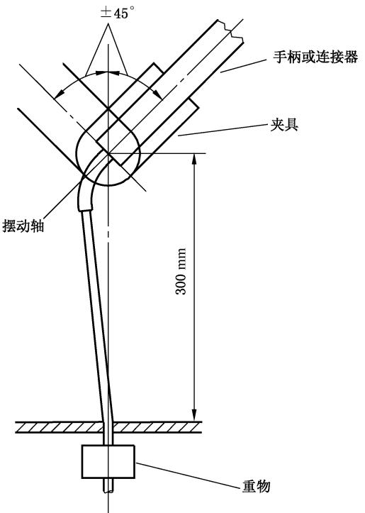

图201.108 手术附件电缆固定装置的试验布置

如果被试手术手柄或手术连接器装有两根或多根电缆，它们应一起试验，加到固定装置上的总重量应是每一根电缆单独要加的重量之和。

摆动杆以 $90^{\circ}$ 摆动（垂直方向上每边 $45^{\circ}$）。

手术手柄的电缆固定装置应以大约 30 次/min 速率摆动 10 000 次（标记为一次性使用的手术附件摆动 200 次），手术连接器的电缆固定装置应以大约 30 次/min 速率摆动 5 000 次（标记为一次性使用的手术附件摆动 100 次）。

试验后，电缆不应失效也应无可见损伤。对于多芯电缆，各芯线不应出现短路。施加张力的重物应增加到 1 kg，并用不超过 1 A 的直流电流检查各芯线的电气连续性。

增补条款：

##### 201.8.10.4.101 \* 开关检测器

###### 201.8.10.4.101.1 概述

除了201.8.10.4.101.2中所述之外，高频手术设备和可用附属设备都应配置一个开关检测器，以便即时响应开关的通断动作而使相应手术输出端子受激或停激。

对于电缆连接的手术附件的开关检测器，应使用与网电源部分和地绝缘的电源供电，如果它与应用部分有导电连接时，供电电压不超过12 V，无导电连接时供电电压不超过交流24 V或直流34 V。

注 1：该要求（也）适用于开关检测器中出现的电压。忽略共模高频电压。

在单一故障状态下，开关检测器不应引起低频患者漏电流超过允许限值（见201.8.7.3）。

通过检查、功能试验以及电压和漏电流测量来检验是否符合要求。

如果开关检测器具有预期连接外部电气开关触点的输入端口，当这些端口上跨接一个 $\geqslant 1000\Omega$ 电阻时，应不能启动高频手术设备的任何输出。

通过功能试验来检验是否符合要求。

每一个开关检测器应只能启动预期的单一手术输出端子，并且一次不应控制多于一个的高频手术模式。

注 2：为满足该要求，一个翘板式开关的两臂被看作是两个独立开关。

###### 201.8.10.4.101.2 非连续启动

开关检测器的非连续启动模式被接受，仅当：

- a）高频手术设备根据设备的专门用途自动停止输出；
- b) 提供一个可视指示器向操作者指明高频手术设备设置于这种专门应用方式；以及
- c) 具有手动停止输出功能。

  通过检查随机文件和功能试验来检验是否符合要求。

###### 201.8.10.4.101.3 用阻抗检测方法启动

只有对双极凝，开关检测器方可根据手术输出端子上呈现的阻抗来启动高频输出。

如果这种阻扰敏感开关检测器具有其他用途或附加到一个触点闭合敏感开关检测器上，那么：

- a）当供电网中断并恢复时，这种检测器在任何情况下应不能单独激励高频输出，以及
- b) 只有当操作者专门选中时，阻抗检测启动才能起作用，以及
- c) 对这种选择应向操作者提供可见指示。

  阻抗敏感开关检测器不应用于单极输出启动，本条要求并不适用于根据专门应用方式只能自动终

  止高频输出的开关检测器[见201.8.10.4.101.2a)]。

  通过检查随机文件和功能试验来检验是否符合要求。

###### 201.8.10.4.101.4 脚踏开关

脚踏开关应符合下述要求（见 201.11.6.5 和 201.12.2）：

启动开关所要求的力不应小于 $10\mathrm{N}$，该力施加于脚踏开关操作表面上任何 $625\mathrm{mm}^2$ 面积上。

通过测量启动力来检验是否符合要求。

## 201.9 ME 设备和 ME 系统对机械危险的防护

通用标准的第9章适用。

## 201.10 对不需要的或过量的辐射危险的防护

通用标准的第 10 章适用。

## 201.11 对超温和其他危险（源）的防护

除下述内容外，通用标准的第11章适用。

#### 201.11.1.1 \* 正常使用时的最高温度

增补：

用电极电缆将高频手术设备的额定输出功率加到一个电阻性负载上，以制造商规定的持续周期运行 $1\mathrm{h}$，但运行时间不少于 $10\mathrm{s}$，间歇时间不多于 $30\mathrm{s}$。

##### 201.11.1.2.1 向患者提供热量的应用部分

增补：

手术电极被认为是应用部分，作为其预期临床效果（切和凝）的一部分预期为患者提供热量。不要求披露温度和临床效果。

##### 201.11.1.2.2 不向患者提供热量的应用部分

增补：

中性电极被认为是应用部分，不预期为患者提供热量。（见201.12.4.101和201.15.101.5）。

#### 201.11.6.3 \*ME 设备和 ME 系统中的液体泼洒

替换：

高频手术设备和附属设备的外壳结构应制成在正常使用时不会因液体泼洒而弄湿电气绝缘和那些一旦弄湿可能影响高频手术设备和附属设备安全的其他元器件。

用下述试验来检验是否符合要求。

在 15 s 内将 1 L 水匀速地倒在高频手术设备和附属设备顶盖中央。预期要装入墙上或箱内的高频手术设备和附属设备，在按建议的那样安装到位后再试验，水应倒在控制面板上方的墙壁上。如此处理后，高频手术设备和附属设备应能承受 201.8.8.3 中规定的电介质强度试验，并且检查可能进入外壳的水对高频手术设备和附属设备安全应不会产生不利影响，特别是那些按通用标准 8.9.1 规定了爬电距离的绝缘上不应有水迹。

#### 201.11.6.5 水或颗粒物质侵入 ME 设备和 ME 系统

增补：

- a）*预期在手术室中使用的高频手术设备和附属设备的脚踏开关，其电气开关部件应防止液体进入，可能引起应用部分意外激励的影响。

  用下述试验来检验是否符合要求。

  将整个脚踏开关在 0.9% 盐水、150 mm 深度下浸没 30 min，在浸没状态下，将脚踏开关连接到与正常使用相对应的开关检测器上并操作 50 次，脚踏开关每释放一次，开关检测器都应指示不启动状态。
- b) * 指揿开关的电气部件应能防止进液影响，进液可能引起应用部分被意外激励（还可参见201.8.8.3.103）。

  用以下试验来检验是否符合要求。

  应在手术连接器的每一个开关端子上用频率至少为 $1\mathrm{kHz}$、电压不超过 $12\mathrm{V}$ 的电源测量其交流阻抗。手术手柄水平支撑起来至少 $50~\mathrm{mm}$，其最上面的开关启动部件应高于任何表面。在 15 s 内将 1 L 0.9% 盐溶液匀速地倒在手术手柄上，并要弄湿手术手柄整个长度。允许溶液自由滴离。开关端子上的交流阻抗应保持在 $2000\Omega$ 以上。

  此后立即对每一个指揿开关操作和释放10次，在每一次释放后 $0.5\mathrm{s}$ 内开关端子上的交流阻抗应超过 $2000\Omega$。

#### 201.11.6.7 \*ME 设备和 ME 系统的灭菌

增补：

除非标记为仅一次性使用，手术附件及其所有可拆卸部件（不用工具可从电缆上拆卸下来的手术连接器除外），经过通用标准该条款规定的试验后，都应符合本文件的要求。

### 201.11.8 ME 设备的供电电源/供电网中断

当高频手术设备电源关断再接通，或者供电网中断再恢复时：

- 输出控制器一个给定设定下的输出功率不应增加 $20\%$ 以上，并且
- 除了不产生功率输出的待机状态之外，原来选择的高频手术模式不应改变。

通过以下操作，测量 1 s 内的平均功率和观察工作模式来检验是否符合要求：

- a）反复操作高频手术设备的电源开关；
- b) 高频手术设备电源开关处于接通位置，中断和恢复供电网。

## 201.12 控制器和仪表的准确性和危险输出的防护

除下述内容外，通用标准的第12章适用。

### 201.12.1 控制器和仪表的准确性

增补条款：

#### 201.12.1.101 输出控制设定的准确性

对于超过额定输出功率的 10% 的输出功率，作为负载电阻和输出控制设定函数的实际输出功率与 201.7.9.3.1 所规定的图示值偏差不应超出 $\pm20\%$。

通过使用合适负载电阻值的201.12.1.102试验来检验是否符合要求。

#### 201.12.1.102 输出控制设定的单调性

输出功率不应随输出控制设定的下降而升高（见201.7.9.3.1、图201.109和图201.110）。

通过以下试验来检验是否符合要求：

- **a) \*单极输出**

  在包括 $100 \Omega$、$200 \Omega$、$500 \Omega$、$1000 \Omega$、$2000 \Omega$ 和额定负载等至少为 5 个特定负载电阻值上，测量作为输出控制设定函数的输出功率。应使用与高频手术设备一起提供的手术附件和中性电极，或者使用 3 m 长绝缘导线来连接负载电阻。

  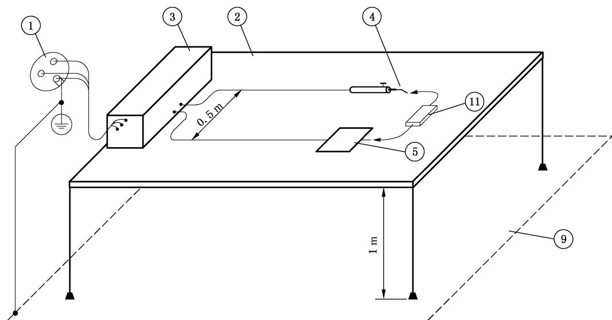

  标引序号说明：

  ①——供电网；

  ②——绝缘材料制作的台板；

  ③——高频手术设备；

  ④——手术电极；

  ⑤——中性电极、金属或与同样尺寸的金属箔相接触；

  ⑨——接地的导电平面；

  ⑪——负载电阻，如要求，可带高频功率测量装置。

  图 201.109 输出功率的测量——单极输出
- **b) \*双极输出**

  在包括 $10 \Omega, 50 \Omega, 200 \Omega, 500 \Omega, 1000 \Omega$ 和额定负载等至少 5 个特定负载电阻值上，测量作为输出控制设定函数的输出功率，应使用与高频手术设备一起提供的双极电极电缆，或者使用额定电压 $\geqslant 600 V$ 的 3 m 长双导体绝缘电缆来连接负载电阻。

  制造商应提供用双极附件的替代形式如何设置这些测量的具体说明。

  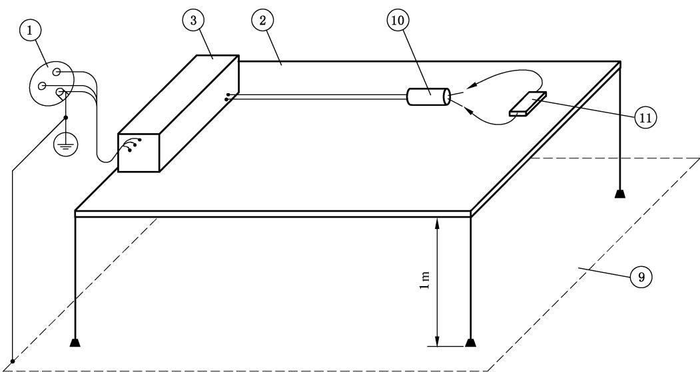

  标引序号说明：

  ①——供电网；

  ②——绝缘材料制作的台板；

  ③——高频手术设备；

  ⑨——接地的导电平面；

  ⑩——启动的双极附件；

  ⑪——负载电阻，如要求，可带高频功率测量装置。

  图201.110 输出功率的测量——双极输出

#### 201.12.1.103 \* 最大输出电压的准确性

对于高频手术设备可用的每一个高频手术模式，施加于手术输出端子上的最大输出电压不应超过201.7.9.3.1中规定的值。

用示波器观察来检验是否符合要求，还可参见201.5.4 aa)。对于每一种高频手术模式，应在输出设定和负载状态能产生最高峰值电压的条件下测量。

### 201.12.2 ME 设备的可用性

增补：

- a）如果使用一个双踏板脚踏开关组件来选择切和凝输出模式，则应设计成：按操作者方向观察，左踏板启动切，右踏板启动凝。通过检查来检验是否符合要求。
- b) * 如果在一个手术手柄上装有独立而分开的指揿开关来选择性地启动切和凝高频手术模式，那么启动切的开关应比另一个开关更靠近手术电极。通过检查来检验是否符合要求。
- c) 应不能同时激励一个以上手术输出端子，除非：

  - 1）每一个手术输出端子具有独立的控制装置来选择高频手术模式、高频输出设定和开关检测器，或者
  - 2）两个单极手术输出端子具有各自的开关检测器并且分担一个公用的电灼（面凝）输出。通过检查和功能试验来检验是否符合要求。
- d) * 同时启动时的提示声响应不同于单个启动时的声响（还可参见 201.12.4.2.101）。除了被操作者启动的那个患者电路之外，任何其他的患者电路绝对不应被激励到 201.8.7.3.101 c)中规定的水平之上。

  通过检查和功能试验来检验是否符合要求。
- e) * 高频手术设备和附属设备上的手术输出端子在结构、外形上应明显不同，以使单极手术附件、中性电极和双极手术附件不能错误连接。

注：见附录 AA。

  通过检查来检验是否符合要求。

- f) * 具有一个以上插脚的手术连接器应有永久固定的脚距，禁止“飞线”连接。

  通过检查来检验是否符合要求。
- g）*如果多于一个高频手术模式可被单个开关检测器激励，在被激励输出前，应提供一个指示以表明被选中的高频手术模式。

  通过检查和功能试验来检验是否符合要求。

### 201.12.4 危险输出的防护

增补条款：

#### 201.12.4.101 \* 大电流模式的使用

高频手术设备应提供一种方法，在大电流模式下，使用具有足够电流承载能力的中性电极，确保无不可接受的温升。在此过程中，201.15.101的要求应在风险管理文档中对大电流模式情况具体分析。该要求应被认为是一个基本性能要求。

通过检查制造商的文件和风险管理文档来检验是否符合要求。

#### 201.12.4.2 \* 有关安全的指示

增补：

如果任何高频手术模式，包括各个独立输出（如可用）被同时启动时，每一个输出端接入额定负载的总输出功率，在任何1 s时间内平均超过400 W，那么风险管理文档中应给出潜在危险的特殊考虑，特别是关于中性电极。

通过测量来检验是否符合要求。

增补条款：

##### 201.12.4.2.101 输出指示器

高频手术设备应配备一指示器，当任何输出电路由于一个开关检测器的工作或者因一个单一故障状态而被激励时提供一个可听的（声响提示）信号。声音输出的主要能量应包含在 $100\mathrm{Hz}\sim 3\mathrm{kHz}$ 的频段内，根据制造商规定的方向上离高频手术设备 $1\textrm{m}$ 距离处，声源产生的声级至少应为 $65\ \mathrm{dB}$（A 计权）。可配备一个可触及的声级控制器，但不应将声级降到 $40\ \mathrm{dB}$（A 计权）以下。对于模拟启动，还可参见201.12.2d)。

为了使操作者能区分 201.8.4.101 所述可听报警和以上规定的可听信号，应将前者制成脉动式的或者使用两种不同的频率。

注：该可听信号不适用 YY 9706.108—2021 中“报警信号”的定义。见本文件第 208 章。

通过功能检查和声级测量来检验是否符合要求。

#### 201.12.4.3 过量输出值的意外选择

增补条款：

##### 201.12.4.3.101 \* 输出降低的方法

对于每一个高频手术模式，除了201.7.9.2.2.101a)7)和201.7.9.3.1所提要求外，高频手术设备应配备一个装置（输出控制器）以使输出功率可降到额定输出功率的 $5\%$ 或 $10\mathrm{W}$ 以下，取其较小者（还可参见201.12.1.102）。

通过测量输出功率和检查来检验是否符合要求。

#### 201.12.4.4 不正确的输出

增补条款：

##### 201.12.4.4.101 \* 单一故障状态下最大允许输出功率

额定输出功率大于 50 W 的单极高频手术设备和所有高频手术设备的双极输出都应配备一个报警和/或连锁系统，来指示和/或防止输出功率相对于输出设定的明显增加。

在单一故障状态下，最大允许输出功率应对每一个患者电路和工作模式分别计算。

单一故障状态下最大允许输出功率规定见表201.102。

**表 201.102 单一故障状态下最大输出功率**

| 设定（额定输出功率的百分比范围 P/%） | 单一故障状态下最大允许输出功率 |
| ------------------------------------ | ------------------------------ |
| P < 10                               | 额定输出功率的 20%             |
| 10 ≤ P ≤ 25                        | 设定值 × 2                    |
| 25 < P ≤ 80                         | 设定值 + 额定输出功率的 25%    |
| P > 80                               | 设定值 + 额定输出功率的 30%    |

通过技术说明书检查和合适单一故障状态的模拟试验来检验是否符合要求。

##### 201.12.4.4.102 \* 同时激活期间的输出功率

对于可同时启动多于一个以上患者电路（参见201.12.2）的高频手术设备，当这些患者电路在任何可用的高频手术模式组合下同时启动时，其释放的输出功率不得超过201.12.1.101规定的偏差20%。

任何单独启动的患者电路应符合201.12.1.101。

通过以下试验（见图 201.111）来检验是否符合要求。

对于201.12.2c)所定义的高频手术设备：

被试输出以 $20\%$ 额定输出功率启动，并记下此时的输出高频电流读数，然后任何其他输出在最大功率下启动，被试输出电流不应增加 $10\%$ 以上。

被试输出分别以 50% 和 100% 输出设定启动，记下输出电流值，当另一输出也启动时，被试输出电流不应增大 10% 以上。

对于可以在任一时刻一同启动输出的所有可能组合，重复进行这些试验。

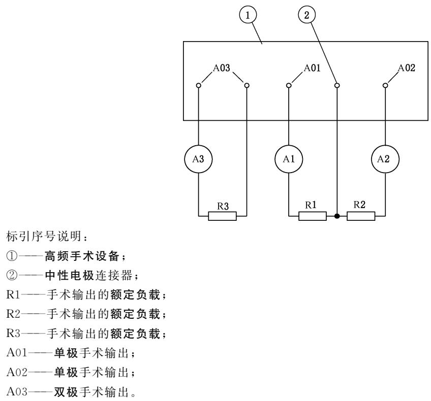

图 201.111 同时启动的手术输出之间相互影响的试验方法

## 201.13 ME 设备危险情况和故障状态

除下述内容外，通用标准的第13章适用。

#### 201.13.2.13 过载

增补条款：

##### 201.13.2.13.101 \* 电极短路影响的防止

高频手术设备在最大输出设定下激励时，应能无损伤地承受输出开路和短路的影响。

通过以下试验来检验是否符合要求：

将 201.12.1.102 中 a) 和 b) 所述 3 m 导线连接到患者电路连接（点）上，对于每一种高频手术模式，将输出控制器设定在最大位置。然后启动输出，让一对启动导线远端短路 5 s，然后开路 15 s，再停止输出 1 min。重复循环 10 次。

该试验后，高频手术设备应符合本文件的所有要求。

## 201.14 可编程医用电气系统（PEMS）

通用标准的第 14 章适用。

## 201.15 ME 设备的结构

除下述内容外，通用标准的第15章适用。

#### 201.15.4.1 连接器的构造

增补条款：

##### 201.15.4.1.101 \* 第三方提供的手术电极的兼容性

带有可拆卸手术电极的手术附件制造商应对预期加接到手术附件上去的任何手术电极配件给出尺寸及其精度要求。

通过对随机文件的检查来检验是否符合要求。

带有可拆卸手术电极的手术附件制造商应在随机文件中规定预期可兼容的手术电极。

通过一致性演示来检验是否符合本文件所有相关要求。

##### 201.15.4.1.102 \* 可拆卸手术电极的拆卸力

可拆卸手术电极制造商应在手术附件的随机文件中规定其预期用途。

可拆卸手术电极应能牢固地装入规定的手术附件。

通过检查和下述试验来检验是否符合要求：

将可拆卸手术电极在规定的手术附件中插拔10次，再插入后，沿插入轴方向用等于手术电极10倍重量的拉力（最大 $10\mathrm{N}$），在 $1\mathrm{min}$ 内应不能拔出该电极。

在可拆卸手术电极插入规定的手术附件的情况下，其组件应符合本文件其他所有适用的要求。

增补条款：

#### 201.15.101 \* 中性电极

##### 201.15.101.1 中性电极的通用要求

除了仅预期与一个双极附件连接的任何患者电路之外，额定输出功率超过 50 W 的高频手术设备应配备一个中性电极连接。

通过目测来检验是否符合要求。

##### 201.15.101.2 \* 中性电极电缆的连接

中性电极应与其电缆牢固连接，除了可监测中性电极以外，用于电极电缆及其连接器的电气连续性监测的电流应流过电极的截面。

通过下述试验来检查是否符合要求。

使用至少 1 A，但不大于 5 A 且开路电压不大于 6 V 的直流或工频电流来进行电气连续性试验，电气连续性电阻应 $\leqslant 1 \Omega$。

##### 201.15.101.3 \* 中性电极电缆的连接器

用于中性电极电缆与可拆卸中性电极连接的电气接头应设计成：在与中性电极意外分离事件中，接头的导电部分应不能接触到患者身体。

通过下述试验来检查是否符合要求。

让中性电极电缆拆离中性电极，用通用标准图 6 所示标准试验指检查，电缆连接器的导电部分不得被触及。

##### 201.15.101.4 \* 中性电极电缆的绝缘

中性电极电缆的绝缘应足以防止对患者和操作者产生灼伤。

通过下述试验步骤来检查是否符合要求：

- 根据 201.8.8.3.102 a) 以 400 V 峰值电压进行高频泄漏试验，高频漏电流 $I_{\text{漏}}$ 不应超过：

  $$
  I_{\text{漏}}[\mathrm{mA}] = 4.0 \times 10^{-5} \times d \times L \times f_{\text{试}} \times U_{\mathrm{p}}
  $$

  或者根据201.8.8.3.102b)进行高频漏电容试验。高频漏电容不应超过

  $$
  C_{\text{漏}}[\mathrm{pF}] = 8.8 \times d \times L
  $$

  式中：

  d ——绝缘的最小外径，单位为毫米（mm）；

  L ——浸入盐溶液中的样品绝缘长度，单位为厘米（cm）。

  根据201.8.8.3.103以 $500\mathrm{V}$ 峰值高频试验电压进行高频电介质强度试验，不得出现绝缘击穿现象。

  根据201.8.8.3.104以 $2100\mathrm{V}$ 峰值试验电压进行工频电介质强度试验，不得出现绝缘击穿现象。

##### 201.15.101.5 \* 中性电极的热性能

按使用说明书在正常使用状态下应用时，中性电极不应使患者接触部位受到热损伤风险。

通过下述试验来检查常规的中性电极是否符合要求。

注：常规的中性电极是指不适用于大电流模式的中性电极。

对于带有如表 201.103 所示患者重量标记的中性电极，施加规定的试验电流 $I_{\text{试}}$ 60 s 后立即测量，中性电极与患者接触部位下的任何 $1\,\mathrm{cm}^2$ 面积和向外延伸的 $1\,\mathrm{cm}$ 范围，最大温升不应超过 $6\ ^\circ\mathrm{C}$。

**表 201.103 按体重范围使用的试验电流**

| 患者体重范围     | $I_{\text{试}}/\mathrm{mA}$ |
| ---------------- | ----------------------------- |
| < 5 kg           | 350                           |
| 5 kg ~ 15 kg     | 500                           |
| > 15 kg 或未标记 | 700                           |

对于所有可监测中性电极，试验接触面积应是如201.8.4.101符合性试验中求得的 $A_{\mathrm{a}}$（报警面积）。对于所有其他的中性电极，试验接触面积应根据使用说明书所指定的应用面积。

对于预期用于小患者的中性电极，这些试验可在成人活体对象上进行。所用被试中性电极的试验表面应是人类皮肤，或电热等效代用品或试验装置。应最少使用四个不同样品对人体对象重复这些试验。如果使用代用品或试验装置，则应试验至少10个不同的中性电极样品。

这些至少10个不同样品中的每一个应用来自另一个人体对象的报警面积 $A_{\mathrm{a}}$ 试验。对于每个人体对象的试验应使用个体的报警面积 $A_{\mathrm{a}}$，如201.8.4.101中符合性试验中求得的。如果试验装置含有CQM模拟电路，报警面积 $A_{\mathrm{a}}$ 也能通过该试验装置来确定。

用代用品或试验装置时，中性电极和试验表面的初始温度应为 $23\ ^\circ\mathrm{C} \pm 2\ ^\circ\mathrm{C}$，试验表面的基准温度应在中性电极加到试验表面上之前即时记录。除了接触面积为 $A_{\mathrm{a}}$ 之外，应根据提供的使用说明书将中性电极加到试验表面上。在施加试验电流之前中性电极应在一个稳定温度环境下静置于试验表面 30 min。如果使用电热等效代用品或试验装置，一旦达到热平衡就可开始试验。

加到待试中性电极上的试验电流 $I_{\text{试}}$，应是近似的高频正弦波，并且应在试验开始的 5 s 内施加电流，该电流在 100%～110% 的 $I_{\text{试}}$ 范围内保持 60 s ± 1 s。

试验表面的第二次温度检查，应在试验电流终止后 15 s 之内完成，同基准温度相比较，任何 $1\,\mathrm{cm}^2$ 面积上的温升不得超过 $6\ ^\circ\mathrm{C}$。

温度测量指示精度要优于 $0.5\ ^\circ\mathrm{C}$，并且至少一个样品要在整个中性电极接触面积加上该面积边缘 $1\,\mathrm{cm}$ 范围内的面积上具有 $1\,\mathrm{cm}^2$ 的空间分辨率，基准温度检查和第二次温度检查之间的部位偏差应在 $\pm 1.0\,\mathrm{cm}$ 之内。

在使用人体对象时，至少由不同皮肤组织形态的（例：皮下脂肪层薄的、中等的和厚的等）男性和女性各5人组成。

任何代用品或试验装置应提供经文件证实的数据，表明它产生的温升不低于至少20个人体对象上获得的原始数据。

##### 201.15.101.6 \* 中性电极的接触阻抗

在中性电极应用部位表面和中性电极电缆的连接（距中性电极导电表面的连接处 5 cm 内）之间的电气接触阻抗应足够低，以防止流通高频手术电流时产生欧姆热引起灼伤患者的风险。

在 $200\ \mathrm{kHz} \sim 5\ \mathrm{MHz}$ 频率范围内，导电性中性电极接触阻抗应不超过 $50\ \Omega$，电容性中性电极接触电容应不低于 $4\ \mathrm{nF}$。

注：在本文件中，除制造商另有规定，导电性中性电极在 200 kHz 下，接触阻抗具有的相位角 $\leqslant45^{\circ}$，而电容性中性电极在 200 kHz 下，接触阻抗具有的相位角 $\geqslant45^{\circ}$。

随机抽取至少10个待试中性电极样品进行下述试验来检查是否符合要求。

中性电极全部面积稳固地置于一金属平板上。一个真有效值响应的交流电压表接在金属平板和中性电极电缆导体之间，在距中性电极的导电表面连接处 $5\mathrm{cm}$ 内，以测量试验电压 $U_{\text{试}}$，该电压表在 $200\mathrm{kHz}\sim 5\mathrm{MHz}$ 范围内具有优于 $5\%$ 的精度。在中性电极电缆导体和金属平板之间，通入试验频率 $f_{\text{试}}$ 在 $200\mathrm{kHz}\sim 5\mathrm{MHz}$ 范围内，基本是正弦波的 $200\mathrm{mA}$ 试验电流 $I_{\text{试}}$，并用合适的真有效值交流电流表监视。

记录 $f_{\text{试}} = 200\ \mathrm{kHz}$、$500\ \mathrm{kHz}$、$1\ \mathrm{MHz}$、$2\ \mathrm{MHz}$ 和 $5\ \mathrm{MHz}$ 时的 $U_{\text{试}}$ 和 $I_{\text{试}}$，对每一个 $f_{\text{试}}$ 计算接触阻抗 $Z_{\mathrm{c}}$：

$$
Z_{\mathrm{c}} = \frac{U_{\text{试}}}{I_{\text{试}}}
$$

计算接触电容 $C_{\mathrm{c}}$

$$
C_{\mathrm{c}}[\mathrm{nF}] = \frac{I_{\text{试}} \times 10^{6}}{2 \pi \times f_{\text{试}} \times U_{\text{试}}}
$$

式中：

$U_{\text{试}}$ ——有效值高频试验电压，单位为伏（V）；

$I_{\text{试}}$ ——有效值高频试验电流，单位为安（A）；

$f_{\text{试}}$ ——高频试验电压频率，单位为千赫（kHz）。

##### 201.15.101.7 \* 中性电极的粘附

对于中性电极，除可监测中性电极的和标记用于患者重量小于 15 kg 的中性电极之外，如果使用说明书指明中性电极要粘贴到患者身上，粘胶剥离强度在预期的使用状态下应足以保证接触的安全程度。

通过下述试验来检查是否符合要求。

预期用于小患者的中性电极可用成人对象进行试验。可以使用被证明等效于人体对象的代用品试验表面。

- a）持粘力试验：

  每个试验对象至少用两个被测中性电极样品，按使用说明书所示应用于至少10个男性和10个女性对象的适宜部位，保持 $5\mathrm{min}\sim 10\mathrm{min}$。对于预期用于成人患者的中性电极，在中性电极电缆连接点处，沿着与皮肤表面平行的每个坐标轴方向，对连接的中性电极电缆施加 $10\mathrm{N}$ 的力 $10\mathrm{min}$。在该连接点处，一个轴具有较小尺寸。至少 $90\%$ 的试验中，不应有 $5\%$ 以上中性电极粘胶面积与皮肤表面分离。
- b) 柔顺性试验：

  被试中性电极应用于5个男性和5个女性人体对象的近似圆柱形部位，如四肢，该部位周长应是中性电极主轴方向长度的1.0倍～1.25倍，中性电极主轴包裹于该部位。贴好1 h中，不应有10%以上粘胶面积与皮肤表面分离。

注：如果使用说明书中指明中性电极贴于手术患者朝下的一面，则不要求进行柔顺性试验。

- c) 液体耐受试验：

  中性电极置于至少5个男性和5个女性人体对象身上，如果中性电极预期使用可重复使用电缆，则要用合适连接器连接中性电极。在 5 s～15 s 内，将 1 L 0.9% 盐水从 300 mm 高度直接倒向中性电极，泼洒盐水后 $15\mathrm{min}$ 内，不应有 $10\%$ 以上粘胶面积与皮肤表面分离。

##### 201.15.101.8 \* 中性电极的货架寿命

标记为一次性使用的中性电极在其制造商规定的有效期内，应符合201.15.101.5至201.15.101.7中的要求。试样可根据其使用说明书从实际贮存正好要到期的中性电极中抽取，或者通过一个被证明等效于建议贮存条件的加速老化循环获得。

通过对有效期到期前或者加速老化完成后的30天内的中性电极进行试验来检查是否符合要求。

##### 201.15.101.9 \* 成人中性电极的常规手术

导电性中性电极预期用于成人患者，因此被批准用于体重超过 $15 \, kg$ 的患者时应是可监测中性电极。该要求不适用于使用大电流模式的中性电极。

注 1：在本文件中，除制造商另有规定，导电性中性电极在 200 kHz 下，接触阻抗具有的相位角 $<45^{\circ}$，而电容性中性电极在 200 kHz 下，接触阻抗具有的相位角 $\geqslant45^{\circ}$。

注 2：常规手术是指那些不使用大电流模式的手术。

## 201.16 ME 系统

通用标准的第 16 章适用。

## 201.17 ME 设备和 ME 系统的电磁兼容性

通用标准的第 17 章适用。

## 202 * 电磁兼容——要求和试验

除以下内容外，YY 9706.102—2021 适用。

### 202.6.1 发射

#### 202.6.1.1.1 要求

增补：

- aa）当高频输出激励时，这些要求和测试不适用于高频手术设备；
- bb）高频手术设备通电时并且高频输出未激励的空置状态下，应符合 GB 4824—2019 中第 1 组的要求。制造商应根据其预期用途声明高频手术设备是 A 类还是 B 类。

### 202.6.2 抗扰度

#### 202.6.2.1.10 符合性准则

增补：

下列性能的降低不影响基本性能或者基本安全。

- 高频功率输出的中断或复位到待机模式在高频手术设备的操作面板上清楚指示时；
- 如201.12.1.101中允许的输出功率传输的变化。

如果上述变化满足 YY 9706.102—2021 的要求，应认为符合要求。

## 208 医用电气设备和医用电气系统中报警系统的通用要求、试验和指南

除以下内容外，YY 9706.108—2021 适用：

修改：

201.8.4.101 中描述的可听警报和红色警示灯不应被认为是 YY 9706.108—2021 中定义的报警信号。

201.12.4.2.101 中描述的可听的（声响提示）信号不应被认为是 YY 9706.108—2021 中定义的报警信号。

## 附录

通用标准的附录适用。

## 附录 AA

（资料性）

### 专用指南和原理说明

### AA.1 通用指南

本附录对本文件的一些重要要求给出简要的原理说明，预期提供给那些熟悉该标准议题而未参与标准制定的人们。对于主要要求的原理的理解对于正确使用标准是重要的。此外，随着临床实践和技术的变化，相信现有要求的原理说明将会促进因这种进步而必需对标准实施的修订。

注：测试这些设备的符合性和操作时当高频启动时由于高频电场的暴露能造成测试设备超出正常运行。因此适当的预防措施和检查要考虑在内。这种情况也会发生在设备附近的医用支持仪器上。

### AA.2 特殊章和条款的原理说明

以下是本文件中的特殊章和条款的原理说明，与本文件的正文的章和条款相对应。

#### 条款 201.1.1 范围

本文件适用范围不包括电灼设备，即：用电加热的金属棒或线圈的医学治疗的设备。某种意义上说本版专用标准为高频手术设备和高频附件提供了单独的要求和试验，不论其制造商是谁。附属设备被包含于附件定义中。

#### 条款 201.3.207 附属设备

附属设备的例子有“氩气（流）控制装置（仪）、附件泄漏监测器、中性电极接触监测器等。见图 AA.1。

#### 条款 201.3.208 双极

该项预期等同适用于设备和附件，因此它与201.3.209（双极附件）是有区别的，也可能代替201.3.209。

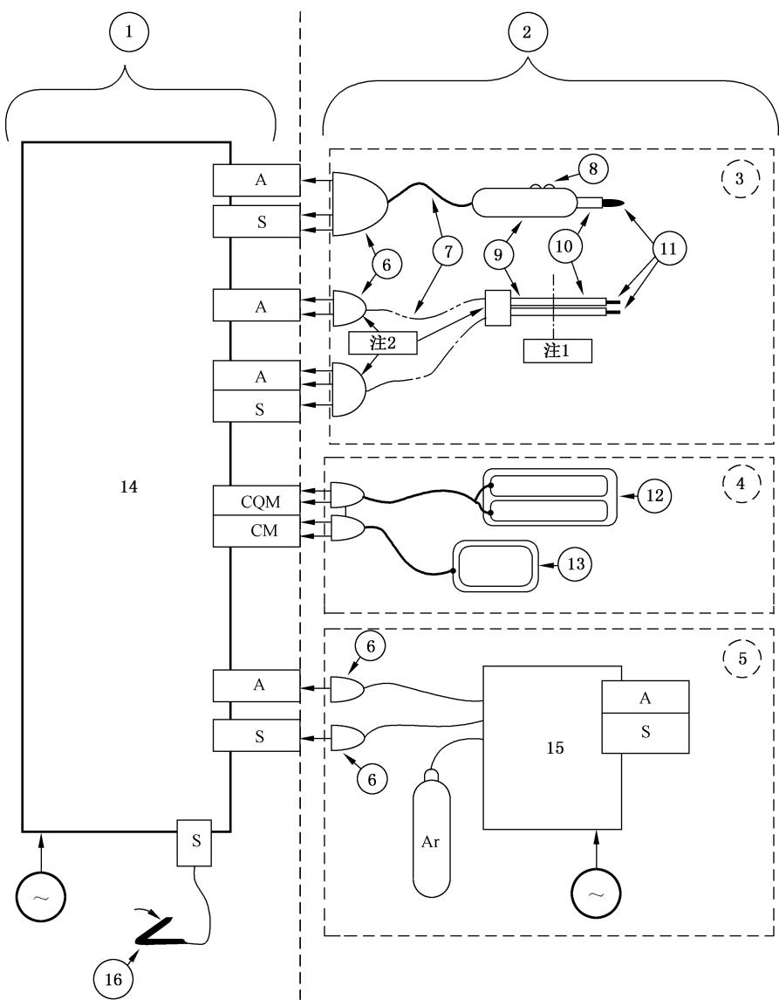

标引序号说明：

- ①——高频手术设备；
- ②——高频附件；
- ③——手术附件；
- ④——中性电极；
- ⑤——附属设备；
- ⑥——手术连接器；
- ⑦——手术附件电缆；
- ⑧——指揿开关；
- ⑨——手术手柄；
- ⑩——手术电极绝缘；
- ⑪——手术电极；
- ⑫——可监测中性电极；
- ⑬——不可监测中性电极；
- ⑭——高频手术发生器；
- ⑮——（原图此处编号在转换中丢失，请对照标准原图补全）；
- ⑯——脚踏开关；
- A——手术输出端子；
- S——开关检测器；
- CQM——接触质量监测器；
- CM——中性电极连续性监测器；
- Ar——氩气源；
- $\sim$——供电网。

注 1：制造商决定手术手柄和手术绝缘之间的界线的位置。

注 2：双极附件可包括也可不包括作为手术附件一部分的开关。

注 3：附件和中性电极未按比例显示。

图 AA.1 一个高频手术 ME 系统各种部件的示例

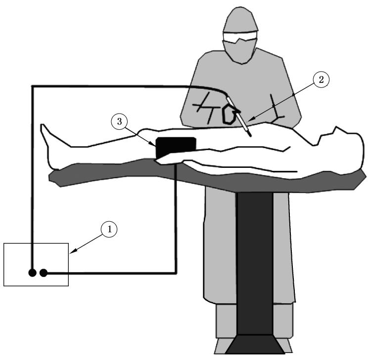

标引序号说明：

①——高频手术设备（发生器）；

②——手术附件；

③——中性电极。

图 AA.2 使用中性电极的高频手术单极方法的示例

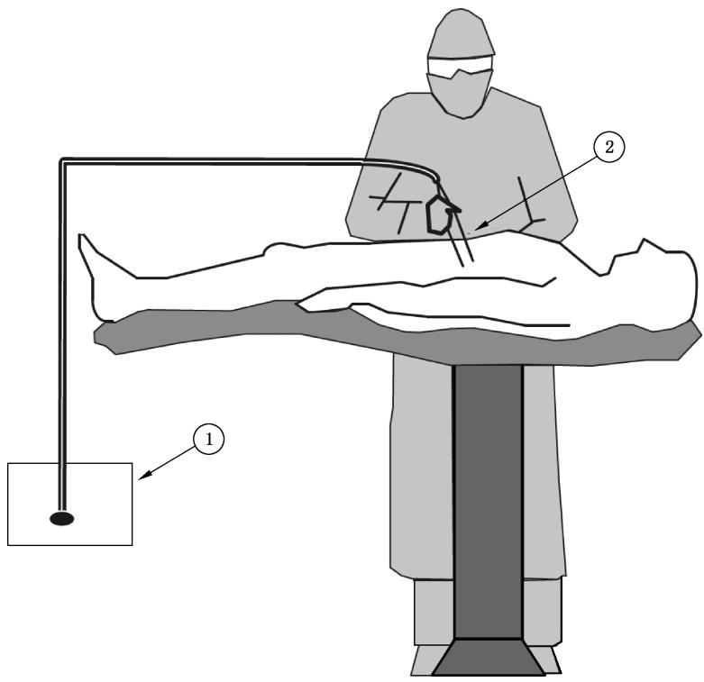

标引序号说明：

①——高频手术设备（发生器）；

②——双极附件。

图 AA.3 高频手术双极方法的示例

#### 条款 201.3.213 峰值系数

峰值系数在数学上是简单的，但要可靠进行测量却又是困难的，有效值电压特别难以测量。定义中提出宜在开路状态下测量，这表示在高频手术设备输出端是没有正常负载的。测量这些电压的高压探头所呈现负载（典型的为 $10\mathrm{M}\Omega$ 到 $100\mathrm{M}\Omega$）被认为基本上为开路状态。下面建议的测量方法具有一个合理的精度。

用一个 1 000 倍或 100 倍衰减的高压探头，连到一个具有自动测量能力的高质量数字存贮示波器 (DSO) 上，测量从单极输出到中性电极和双极输出的两电极上的波形。先测出精确的信号周期，对于连续正弦波（cf=1.4），就是对应的基波周期。对于非连续波，测量脉冲列的时间周期。譬如，一个凝波形具有 400 kHz 基频和 20 kHz 的脉冲重复频率，精确测量 20 kHz 正是要求的脉冲重复频率。这个时间周期一测好，就可调节 DSO 的时间基准使其整个屏幕含有 5 到 10 个精确周期。例如，脉冲重复频率准确地为 20 kHz，该周期就是 50 μs，设置 DSO 的时基为每格 50 μs，则你就可以在屏幕上精确地得到 10 个波形的脉冲波形。

这个波形可被捕捉和贮存。测量和记录最大输出电压（最大峰值的绝对值）。然后计算有效值电压。最可靠的方法是使用 DSO 来计算整个屏幕的有效值。当调节时基捕捉到精确的复合波形时，有效值电压的计算应是正确的。

测量有效值电压的另一个方法是：可将高压探头输出接到一个热敏感性真有效值电压表上，测量的就是该峰值系数和波形的额定电压值（有效值）。

现在就能计算峰值系数了。

#### 条款 201.3.214 切（割）

人们通常认为高频手术切（割）包括显微镜下细胞消融，这是手术电极与组织之间的小电火花产生的。

#### 条款 201.3.215 以地为基准的患者电路

为符合本文件，该路径上的阻抗至少在最低高频工作频率下为 $10\Omega$ 或更小，见图 AA.5。

#### 条款 201.3.217 电灼（面凝）

电灼通常需要高频峰值输出电压至少 2 kV，以便点燃和维持长的火花。这种模式还被称为面凝（喷凝）或非接触凝，结合惰性气流如氩气还可以增强。

#### 条款 201.3.218 发热因子

该值是根据在有限时间周期内传输的能量来描述施加到中性电极的热应力的一种方式。

注：附加信息见本附录对条款 201.15.101.5 的说明。

#### 条款 201.3.219 大电流模式

该模式描述的情况是中性电极热应力的值大于201.15.101.5验证试验中的值。

#### 条款 201.3.220 高频

200 kHz 以上频率宜被用于单极应用，以防止非预期的神经肌肉刺激，这种刺激在使用低频电流时会产生。如果风险分析显示神经肌肉刺激的可能性已被降低到可接受水平，则较低的频率可被用于双极技术。

名义上高于 $5\mathrm{MHz}$ 的频率不被采用，是为了使与高频漏电流相关的问题最小化。一般公认 $10\mathrm{mA}$

是对组织产生热效应的下限。

#### 条款 201.3.225 高频手术模式

术语“高频手术模式”宜同通用标准6.6和7.2.11中的对操作持续周期所用“运行方式”相区别。

#### 条款 201.3.226 最大输出电流

制造商需要这些信息以便设计适用于大电流模式的中性电极。该值用于计算中性电极承受的最大加热因子。

#### 条款 201.3.227 最大输出电压

这个参数预期被操作者用来与额定附件电压相比对以保证安全。

#### 条款 201.3.228 可监测中性电极

只有使用一个可监测中性电极时，接触质量监测器才能起作用。由于导电区域被分成两个或多个部分，所以可监测中性电极也被称为分裂或分割极板。

#### 条款 201.3.229 单极

这个定义预期等同适用于设备和附件，因此它与之前的201.3.203（手术电极）是有区别的。

#### 条款 201.4.1.101 应用的附加条件

高频手术设备和高频附件的市场已经发展成为一个客户在选择购买高频附件时有多个供应商。由于制造商并不总是能够知道何种高频附件将连接到他们的设备上，因此本文件尝试将高频手术设备的所有要求与高频附件的要求分开。鉴于这种划分和已知的市场种类，要求高频手术设备制造商证明其设备与所有可能的高频附件相匹配是不合逻辑的。出于同样的原因，要求高频附件的制造商证明其附件与所有可能的高频手术设备相匹配也是不合逻辑的。

在某些情况下，制造商可生产高频手术设备和高频附件的专用组合以确保预期目的。

#### 条款 201.4.2.3.101 风险评估

在单极手术中，作为一个系统使用的三个要素是高频附件、高频发生器和中性电极。这些任何一个或多个要素的制造商都需要考虑在大电流情况下使用其产品的可能性。这些情况可能包括但不限于：组织损伤、组织消融、组织汽化以及将导电流体引入手术部位以扩张或传导高频电流的手术。在大电流情况下，存在一个风险，即使用中性电极时过高的发热可对患者造成伤害。

#### 条款 201.4.3 基本性能

除201.4.3中所列条款外，相信所有的章都涉及通用标准中定义的基本安全。与大电流模式一起使用的中性电极的要求被认为是基本性能，因为没有足够的公开可获得的技术信息来创建合格/不合格的标准，且患者烧伤的可能性是不可接受的风险。另一方面，常规的中性电极的合格/不合格标准是基于充足的技术信息，足以防止不可接受的风险，因此不被认为是基本要求。制造商有能力根据其风险管理过程识别被认为是基本性能的高频手术设备的其他功能。

#### 条款 201.5.4 其他条件

测量高频电流的仪表，包括高频电压表与电流传感器组合表，要能在 $10\mathrm{kHz}$ 到5倍的被测高频手术模式的基频范围内以 $5\%$ 或更高精度提供真有效值。高频输出仪表要能在施加测量参数的3s内提供要求精度的测量值。高频电流或高频功率少于 $1\mathrm{s}$ 时间的瞬态读数可忽略。

用于高频试验电阻的额定值应不小于给定试验功耗的 $50\%$，且阻抗的电阻分量精度宜在规定值的 $3\%$ 以内，在 $10\mathrm{kHz}$ 到被测高频手术模式5倍基频之间的阻抗相角不大于 $8.5^{\circ}$。

用于测量高频电压的仪表额定值不低于 $150\%$ 预计的峰值电压，在 $10\mathrm{kHz}$ 到5倍被测信号基频范围内校准精度应优于 $5\%$。

对于每一个高频手术模式，“基频”一词是指最大功率设定下开路运行时被测高频输出电压的最高幅度谱线频率。

本文件的修订延续了 IEC 60601-2-2:2006(AA.2.2.101) 和 IEC 60601-2-2:2009(201.5.4) 中陈述的目的，以便将高频附件的要求和试验同专门的高频手术设备分开。此外，本文件可清楚规定用于要求试验的设备，特别是那些与认可的高频试验方法并无什么关联的器具，以保证结果的复现性。由于功率施加的短暂性和小功率电阻具有较大可用性（易满足低电抗要求），电阻额定功耗低到 $50\%$ 的预计功率是合适的，但不能再低。

#### 条款 201.7.2.10.101 高频附件

在大多数情况下，含有应用部分的高频附件不提供BF型或CF型患者保护。这些保护内置于高频手术设备。

#### 条款 201.7.4.2 控制装置

本条款仅当有输出控制时适用。本文件中输出控制不是必需的。

以相对值对释放到相关负载电阻上的功率进行分度是必要的。但是，如果输出指示给出以“瓦”计的实际输出功率，则在负载电阻整个范围内都应准确，否则释放到患者身上的功率不同于指示值，从而产生不可接受的风险。如果显示数字“0”，那么操作者可能以为在这个控制位置上输出为零。

#### 条款 201.7.8.1 指示灯颜色

指示灯颜色的规范化被认为是一种安全性能。

黄色指示灯多年来被用来指明高频手术设备上的切模式被选中或者在使用中。“混切”模式主要用于附加有不同程度凝血效果的切（割）手术。因“混切”主要功能是“切”，因此认为，当使用“混切”时，黄灯是最合适的。

#### 条款 201.7.8.2 控制器颜色

与规定的指示灯相同的色彩可用于其他地方是为了防止混淆。

##### 条款 201.7.9.2.2.101 a)

关于防止非预期灼伤的建议是基于经验，特别是：

- 1）在本文件的以往版本中，本条款包含将中性电极尽可能靠近手术部位的建议。一般来说，使中性电极与手术部位间距最小化可降低负载电阻、手术电极部位的给定功率、高频手术设备所需的输出功率以及跨接于患者身上的高频电压。然而，如果手术电极和中性电极之间的直接路径包括组织小的横截面积，则电流密度能导致非预期的发热和组织损伤。因此，操作者宜依据中性电极制造商提供的使用说明书来获得具体的放置说明。
- 2）同高频下对地具有低阻抗的物体的小面积接触，可形成高电流密度而产生非预期的灼伤。
- 3）患者身体这些部位之间可能存在高频电位差，会形成非预期的电流流通。
- 4）流向监护设备引线的电流可能引起监护电极部位灼伤。
- 5）电极电缆和患者之间的电容可以引起局部高电流密度。
- 6）在特定情况下，双极技术可以防止非预期的组织损伤，特别是牵涉到具有相对高电阻的粗大骨架或具有相对小截面积的人体部位的手术。
- 8）对于这种情况，在设定一个更大输出功率之前，要检查中性电极及其连接器的使用状态。

  如果可用的仅是双极输出或者额定输出功率不超过 50 W 且不带中性电极的输出，则并不是所有建议都必要。

##### 条款 201.7.9.2.2.101 c)

GB 9706.218 的以往版本中含有这样的要求：高频能量装置制造商提供有关最大允许峰值高频电压以及预期使用模式的信息。人们感到：这些资料一方面是不恰当的，像预期使用模式如“面凝”，在技术上没有明确规定，并且不同品牌和型号的高频手术设备之间差别很大，另一方面，向设备使用者给出过于复杂的信息是不实用的。

因此，更实际的是向使用者仅提供额定附件电压和任何输出设定的最大输出电压，以使使用者能判断：是否任何高频附件或附属设备均可安全地同发生器的任何给定输出设定一道使用。

高频下绝缘的稳定性受到介质发热影响，因此最大输出电压和峰值系数之间的关系是重要的。

此外，应考虑到：所有现在知道的品牌型号发生器，在产生较高输出电压的模式和设定中，峰值系数总是随电压增加而增加。因而，给出输出电压和峰值系数的一个通用关系如图 AA.4。

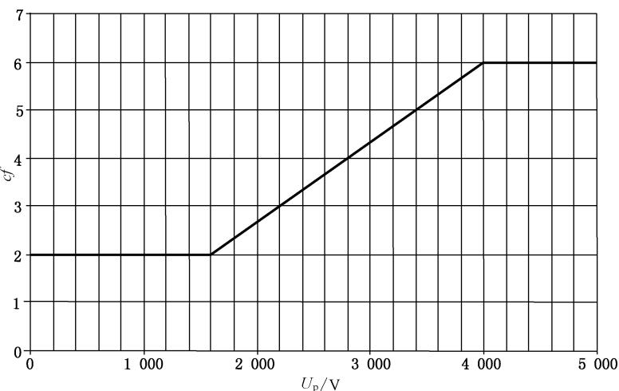

图 AA.4 峰值系数与峰值电压的关系曲线

不管额定附件电压是否与高频手术设备的输出电压相匹配，峰值系数大于或等于曲线值时都属安全状态。由于高频附件和附属设备应满足已考虑峰值系数影响的201.8.8.3.103中要求，故额定附件电压应不低于最大输出电压。

如果一个发生器设置的具有最大输出电压而对应峰值系数落在图 AA.4 曲线之下，则要采取预防措施。在这种情况下，为保证安全，额定附件电压应足够高，以保证在特定高频手术设备的特定高频手术模式和特定输出设定下使用的高频附件和附属设备无绝缘击穿。为考虑到低峰值系数波形时介质发热影响，这种注意是必要的。额定附件电压的安全值应用高频手术设备对高频附件或附属设备进行验证来找出。

##### 条款 201.7.9.2.2.101 e)

操作者应懂得：可监测中性电极配上 CQM 才是安全有效的。许多操作者认为：随着 CQM 的出现，手术中对中性电极接触程度的监视不再必要，这是错误的。

##### 条款 201.7.9.2.2.101 g)

尽管 201.8.4.102 中所要求的措施预期是为了显著减少神经肌肉刺激，但它不能彻底消除，特别是当电弧产生时。因此，警告是必要的，以使用户意识到：在敏感结构中，神经肌肉刺激仍可发生并导致继发性风险，像肌肉收缩引起的损伤。原理说明还可参见 201.8.4.102。

##### 条款 201.7.9.2.2.101 h)

对于在这些条件下使用高频手术装置的系统，人们日益关心中性电极的灼伤。

##### 条款 201.7.9.2.2.101 i)

当然用于通用高频手术设备的各种手术附件不必是 ME 设备制造商提供的。由于这个原因，提供有关用于高频手术设备附件的最大允许长度的信息，以协助操作者选择兼容的高频附件（参见 201.7.9.2.14）。

附件及其电缆的最大允许长度考虑到：

- 1）当进行电磁发射和骚扰试验时指出 ME 的配置，特别是患者耦合电缆的类型和长度，因为 ME 的电磁发射和骚扰两者都受附件及其电缆长度的影响；
- 2）附件及其电缆的最大长度允许符合201.8.7.3.101。

  当进行符合性测试时，附件及其电缆的长度与选择产生最大电磁发射、最小骚扰和可接受的高频漏电流的配置大不相同，制造商不宜假定符合电磁兼容（EMC）和高频漏电流要求。

#### 条款 201.7.9.2.14 附件、附加设备、使用的材料

一些操作者错误地认为CQM是接触质量监测器或可监测中性电极本身固有的（安全）特性。所有操作者理解实现CQM功能所需的所有物理要求尤为重要。

##### 条款 201.7.9.2.14 e)

附件额定电压资料，宜使操作者根据附件绝缘质量来选用与高频手术设备或其输出设定相符合的专用附件。

##### 条款 201.7.9.2.14 f)

操作者应知道：CQM 只能同指定的中性电极一道使用。

##### 条款 201.7.9.2.14 g)

只要操作者能懂得，要用各种方式对相容性进行说明（譬如：在下述条件下，CQM系统发出报警声响的阻抗……，在下列设备表中可找到CQM系统……，从下列制造商处可获得CQM系统……，以及其他方式）。

##### 条款 201.7.9.2.14 j)

该信息是需要的，以使操作者能确保手术电极和手术手柄在使用过程中不可能断开，且在连接处没有外露的导电表面。

#### 条款 201.7.9.3.1 概述

某些特殊的高频手术设备并不具有操作者可调节的输出设定装置。

这些图形可使操作者能判别一个高频手术设备对特定用途的适应性。如果高频手术设备具有不连续的混切选择（例混1、混2等），则每个分立的混切模式均要作图。如果高频手术设备具有可连续调节的可变化混切控制器要置于可提供最大止血效果的混切设定上。

#### 条款 201.8.4.101 中性电极监测电路

高频手术设备中，若不对中性电极电缆中断事故或者中性电极与患者不充分的电气接触进行监测，可导致严重灼伤。因此，作为一个最低要求，对额定输出功率超过50 W的这种高频手术设备，应监测中性电极电路或其连接的故障，对于那些单极额定输出功率小于或等于50 W的高频手术设备为中性电极提供一个连接点。

修改该条标题是为了与高频手术设备中可能存在的其他各种监测电路相区别，譬如输出功率故障监测等。

一个接触质量监测器，在配用相容的可监测中性电极时，可有效地指示功能（是否正常）。与中性电极发热状况的新要求相结合，就可有效减轻中性电极部位灼伤风险。由于涉及现有CQM方案的技术差异和专利权问题，还不能给出一个全面的单独的和强制性的附件要求。

完全接触意味着按使用说明书将中性电极导电部分无任何障碍或间隙地尽可能紧密地施加到人体对象（或合适代用品表面）上。

实现这些要求的采用的替代方法已被添加，以适应除连续性监测器或接触质量监测器以外的技术。作为合适代用品表面评价的指南，建议参阅参考文献[[10]](#ref-10)～[[14]](#ref-14)。

#### 条款 201.8.4.102 神经肌肉刺激

由于手术电极和组织之间的电弧具有整流作用，可能产生的直流或低频成分会引起神经肌肉刺激。使用合适的串联电容和分流电阻可有效减少这种非预期的刺激。

#### 条款 201.8.5.1.2 对患者的防护措施（MOPP）

这些要求降低被认为是合适的，因为“绝缘的电压应力……”具有高频特性，因此如果高频患者电路和外壳之间的绝缘失效，其风险远低于低频时的。在本条款上下文中，高频手术设备的高频患者电路被视为应用部分的部分。

在这种情况下，“中间电路”一词将是通用标准3.110定义的和图J.5所示的次级电路。

#### 条款 201.8.5.2.3 患者导联或患者电缆

通用标准该条的目的是防止患者同地或危险电压连接，假定这种连接可在任何时刻出现，且与患者的连接是持续的或者是失控的。

高频附件的状态很不一样，因为这种设备预期是在医生或经培训的医护人员的控制下使用。本文件该条覆盖的可能危险情况，是在可能将中性电极连接器插入网电源连接器譬如可拆卸电源软电线插座或电源插座中时才会出现。

不像心电图监护电极可由未经电器危险培训的操作者使用，高频手术设备和附件只接受高素质的且经培训的操作者在限制进入的场所使用。

手术附件和双极附件只在医生的直接控制下使用，医生可在来自于患者非预期反应的极轻微信号下终止电极与患者接触。

#### 条款 201.8.5.5 防除颤应用部分

共模试验是指除颤器与高频附件和高频应用部分相结合使用能出现的情况。测量显示，在通常的临床情况下，5 kV 的除颤脉冲会在中性电极和手术电极上产生不超过 1 kV 的脉冲。2 kV 的试验脉冲提供了一个安全余量。电感量（通用标准的图 9）导致试验脉冲的上升时间比正常快。为了提供增强的

绝缘应力的试验目的，这是必需的。

#### 条款 201.8.6.1 要求的适用性

对于不使用中性电极的低功率单极高频手术设备，使用电源电缆的保护接地导线作为功能性高频电流回路是公认的做法，人们认为这并不产生任何安全问题。

#### 条款 201.8.7.1 通用要求

通用标准规定的漏电流要求，预期用来防止电击风险。

本文件对高频漏电流也给出一些要求，是为了降低非预期的灼伤风险。

通用标准中该条款关心的是可引起电击的漏电流，而不是治疗用电流（如高频手术设备产生的）。对于具有多个患者电路的高频手术设备，高频漏电流的合适试验给出在201.8.7.3.101c)项：不同高频患者电路之间的横向耦合。

#### 条款 201.8.7.3 容许值

人们认为仅在分裂式中性电极之间流动的监测电流不需按 CF 型应用部分来限制，不管防电击程度如何（CF 型还是 BF 型应用部分），因为可以预期这些电流绝不会流过心脏。

##### 条款 201.8.7.3.101 a) 高频漏电流

设计为不带中性电极使用的高频手术设备排除在要求之外，是因为这种高频手术设备的功能电流和高频漏电流是区分不开的，因而，测量功能电流和高频漏电流是无意义的。

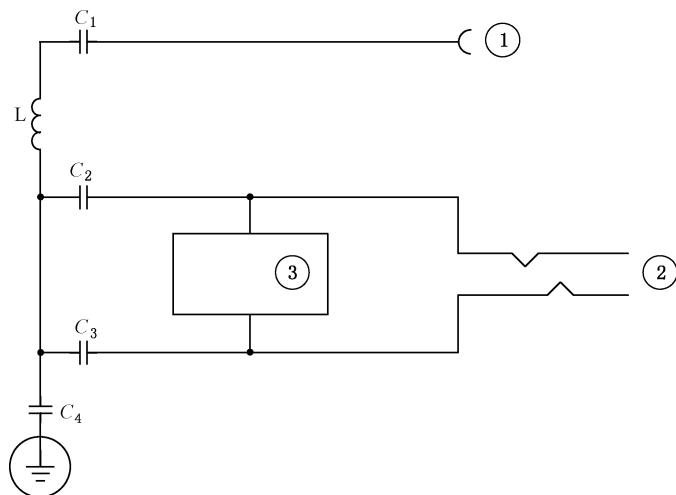

标引序号说明：

①——手术电极连接器；

②——中性电极连接器；

③——监测器；

$C_{1}$ ——不超过 5 nF；

$C_{2}=C_{3}$ ——不超过25 nF；

$X_{c2}$ 和 $X_{c3}$ ——在工作频率下不超过 $20 \Omega$；

$Z_{L}$ 在 50 Hz 时不超过 1 Ω。

注：根据 ME 的设计 $C_{4}$ 可存在也可不存在。

图 AA.5 在工作频率下中性电极以接地为基准的患者电路示例

与通用标准中（低频）漏电流测量不一样，这里规定用一个 200 Ω 测量电阻来模拟在实际状态下占优的负载阻抗，这可以给出最大的泄漏功率。规定的高频漏电流限值产生的功率为 4.5 W，这被认为是合理的。以地为基准的情况中，规定试验 2 是为了检查高频下对地阻抗足够低。

在绝缘台板下面的一个接地导电电平面以及电源软电线折扎成束而不是缠绕成卷，可显著改善测量的复现性。

##### 条款 201.8.7.3.101 a)3)

双极高频手术设备的试验经验表明：这些限制是合理的，试验也是容易的。可评审风险管理文档，以获得对测量的替代方法和/或风险降低的充分解释。

##### 条款 201.8.7.3.101 b) 直接在高频手术设备端口测量的高频漏电流

在输出端口上直接置放负载电阻和测量器具，很容易在高频下对高频手术设备进行绝缘试验。在这种情况下规定限额为 $100\mathrm{mA}$，是因为没有包含引线影响。但是为了保证计入引线和附件（例如带有指揿开关的手术电极）产生的复杂阻抗影响，本文件还包含有201.8.7.3.101a)中的试验。

#### 条款 201.8.8.3.101 手术附件绝缘

高频手术设备产生的高压可出现在高频附件的导电部分。这些附件的绝缘应能承受这种电压应力，并且限制出现在暴露表面上的高频漏电流，以便减轻非预期的患者和操作者灼伤风险。实际使用中，这些绝缘受到相当大的应力，因此要求留有安全余量。在长时间暴露于导电液体和反复消毒（预计一次性使用的附件除外）之后，加在手术附件任何部分的绝缘应保持足够的电介质强度。

注：该条完全重新拟制，以仅仅覆盖手术附件各部分绝缘的电介质强度，而与任何高频手术设备无关。为了协调一致，修改的要求和符合性试验引自ANSI/AAMI HF18和 GB 9706.218 的现行版本。

中性电极要求见201.15.101中。

#### 条款 201.8.8.3.102 手术附件的高频泄漏

高频泄漏要求的依据是 ANSI/AAMI HF18:2001 中 4.2.5.2。这些要求的原理说明如下。为了使用通用国际单位制（SI units），规范性术语和原理说明使用的文字和公式都与原来有所不同。

1 MHz 工作频率和额定附件电压，在试验限额与可能产生 $100 \, mA/cm^{2}$ 电流密度之间也留有一个可观的余量。

所有配合选值允许一个等价的电流密度 $25 \, mA/cm^{2}$，它是判定灼伤的阈值 $100 \, mA/cm^{2}$（持续 $10 \, s$）的四分之一。因此，可以证明，即使在极端临床条件下电流密度高出 1 到几倍，要求中给出的安全余量也被认为是足够的。

在本文件之前版本中，上述原理说明是从ANSI/AAMI HF18:1986的第1版中得到的，并引用了“...等价的电流密度为 $11.46\mathrm{mA} / \mathrm{cm}^2$，这几乎与判定灼伤的阈值 $100\mathrm{mA} / \mathrm{cm}^2$ 相差近一个数量级…”。那时，内窥镜高频手术在一般医师中大部分不被了解，所以这个限制并没有施加技术障碍。最近开发的小关节关节镜手术电极，需要更薄的绝缘和该公认的充裕安全余量相应减少到灼伤阈值的1/4或 $25\mathrm{mA} / \mathrm{cm}^2$ 的评估。还要注意的是，由于功率密度和电流密度的平方成比例，这个变化也相当于电流密度的16倍，功率密度的100倍。参见参考文献[[21]](#ref-21)，推导出 $10\mathrm{s}$ 内皮肤灼伤的阈值为 $100\mathrm{mA} / \mathrm{cm}^2$。由于血液流动更有效地排除热量，对于相同的温升，可预期良好灌注的组织需要更大的电流密度。

中性电极电缆比手术附件电缆允许的泄漏大一倍，是因为中性电极电缆导体与患者皮肤之间出现的电压水平要低得多。双极附件比单极电缆允许的泄漏也大一倍，是因为双极使用的电压比单极模式低得多。

本文件允许的下述限额可使用普通高频手术设备来产生试验电压。

单极附件允许的试验电压范围可超过帕斯更（Paschen）最小值 280 V，以允许电晕产生，但不需超

过典型的切电压（峰值电压约为 1 000 V）。峰值试验电压也不宜超过额定附件电压。

为了与ANSI/AAMT HF18相一致，修改后的电流密度限值为 $25\mathrm{mA} / \mathrm{cm}^2$，如下式调整高频漏电流符合限值：

$$
I_{\text{漏}}[\mathrm{mA}] = 2.0 \times 10^{-5} \times d \times L \times f_{\text{试}} \times U_{\mathrm{p}}
$$

而对于双极电缆和中性电极电缆，高频漏电流加倍：

$$
I_{\text{漏}}[\mathrm{mA}] = 4.0 \times 10^{-5} \times d \times L \times f_{\text{试}} \times U_{\mathrm{p}}
$$

因手术电极绝缘和中性电极电缆绝缘与手术附件电缆是相串联的，故其高频漏电流风险也具有“串联”性质（即较小），因而这些要求中已包含了手术电极绝缘和中性电极电缆绝缘。

其他高频泄漏试验：

ANSI/AAMI HF18 的高频泄漏通道等效电容推导如下：

给定

$$
I_{\text{漏}}[\mathrm{A}] = \frac{U_{\text{试}}[\mathrm{V}]}{X_{\text{漏}}[\Omega]}
$$

和

$$
X_{\text{漏}}[\Omega] = \frac{1}{2 \pi \times f_{\text{试}}[\mathrm{Hz}] \times C[\mathrm{F}]}
$$

那么

$$
I_{\text{漏}}[\mathrm{mA}] \times 10^{-3} = U_{\text{试}}[\mathrm{V}] \times f_{\text{试}}[\mathrm{kHz}] \times 10^{3} \times 2 \pi \times C[\mathrm{pF}] \times 10^{-12}
$$

从而

$$
C[\mathrm{pF}] = \frac{I_{\text{漏}}[\mathrm{mA}] \times 10^{6}}{2 \pi \times U_{\text{试}}[\mathrm{V}] \times f_{\text{试}}[\mathrm{kHz}]}
$$

……（AA.1）

一个正弦波试验电压的有效值等于：

$$
V = \frac{V_{\mathrm{p-p}}}{2 \sqrt{2}} = 0.3536 \times V_{\mathrm{p-p}}
$$

高频泄漏试验用的常量：

$$
V_{\mathrm{p-p}} = 800[\mathrm{V}];
$$

$$
U_{\text{试}} = 282.8[\mathrm{V}];
$$

$$
f_{\text{试}} = 1000[\mathrm{kHz}];
$$

$$
I_{\text{漏}} = 7.85\ d \times L\ [\mathrm{mA}];
$$

按式（AA.1）就得到电容量限额：

$$
C[\mathrm{pF}] = 4.42 \times d[\mathrm{mm}] \times L[\mathrm{cm}]
$$

适用于双极手术附件和中性电极电缆之外的所有附件。这些附件允许使用两倍的漏电流，得到：

$$
C[\mathrm{pF}] = 8.84 \times d[\mathrm{mm}] \times L[\mathrm{cm}]
$$

为了符合本文件，这两组电容值应分别降低到 $4.4 \times d \times L$ 和 $8.8 \times d \times L[\mathrm{pF}]$ 以下。

上述替代的电容型试验方法与之前的高频漏电流方法的技术等同性已由Keller[[15]](#ref-15)和König[[16]](#ref-16)验证。此计算基于最初的HF18电流密度限值为 $11.46\mathrm{mA} / \mathrm{cm}^2$，然而，修改后的 $25\mathrm{mA} / \mathrm{cm}^2$ 限值的应用允许近似两倍的限制电容。

#### 条款 201.8.8.3.103 手术附件的高频电介质强度

由于介电应力实际上是在高频下发生的，因此要求附加高频试验。一个盐水试验电极可合理地模拟手术部位或靠近手术部位潮湿的患者和操作者组织。绕在绝缘上的细导线是为了引起电晕放电故障，这可在接下来的工频电介质强度试验中监测到。每个试验都是独立选择的，以对被挑战的绝缘体施加最坏的应力。峰值电压和峰值系数的测量宜与附件的试验同时进行，以确保其值不会由于附件的接入而改变。这些试验中，在加载状态下测量峰值系数是可以接受的。

这些要求和试验与 GB 9706.218 可能的扩展相一致。

注：手术手柄与手术电极或与可拆卸电缆连接器之间的间隙必需防止纱布溢出的盐水浸入。因此纱布需要彻底滴净。在这些间隙中如果发生因盐水引起的击穿，则用一片薄的导电的金属箔包裹在接缝处防止盐水进入间隙，重复测试。在201.11.6.5中定义了防止液体进入的影响的附加要求。

#### 条款 201.8.8.3.104 手术附件的工频电介质强度

大家知道，高于 $120\%$ 的高频手术设备产生的高频试验电压是难以达到的，升压变压器会使高频波形畸变，而且被试介质电容会使试验电压源加载，为了使绝缘具有一个可接受的较大余量，就要求一个直流或工频试验，这个试验在高频电介质强度试验之后用来监测电晕引起的缺陷。

介电应力产生的温升能改变高频附件的内部结构。高频附件上带有的任何指揿开关，在全部电介质强度试验后，功能宜可靠且不能随意地启动输出。

注 1：用于符合性试验的金属箔具有高导电性。

注 2：手术手柄与手术电极或与可拆卸电缆连接器之间的间隙需要防止纱布溢出的盐水浸入。因此纱布需要彻底滴净。在这些间隙中如果发生因盐水引起的击穿，则用一片薄的导电的金属箔包裹在接缝处防止盐水进入间隙，重复测试。在201.11.6.5中定义了防止液体进入的影响的附加要求。

#### 条款 201.8.10.4.2 连接用电缆

规定该条款的要求（引自 IEC 60601-2-4）是因为手术附件及其电缆在使用中会受到可观应力，同时一些典型故障方式对工作人员和/或患者能引起危险。一旦电缆疲劳，普通的故障就是过载，要么自身着火，要么引起附近物质着火，从而危及工作人员和患者。这些要求将给出这些电缆一个参考寿命。

#### 条款 201.8.10.4.101 开关检测器

要求输出开关是即动型的，是为了防止无意地激励输出。要求使用绝缘的极低电压是考虑到这些脚踏开关、指揿开关及其电缆的使用环境。防止进液影响已在201.11.6.5中规定。

一般认为：如果一个医生不熟悉使用的系统，则使用一个指揿开关来选择多个功能，如切或凝，有可能出现混淆和潜在危险。一个不可接收的例子是：轻按开关给出凝，重按开关给出切。

该条假定设备是通电的。

#### 条款 201.11.1.1 正常使用时的最高温度

这里规定的运行条件被认为是实际使用中可能出现的最恶劣情况。

#### 条款 201.11.6.3 ME 设备和 ME 系统的液体泼洒

1 L 试验量代表一袋/瓶液体（例如一次输液），这被认为在手术室中是可能存在的。

##### 条款 201.11.6.5 a)

脚踏开关在一些手术中可以暴露于可观数量的水或其他液体中，在清洗时，还可整个浸入水中，因此要求防水。

将浸入试验修改成取消功能检查和电介质强度试验还在研究中。现行GB/T4208中没有试验适用于这种预期手术室环境。

##### 条款 201.11.6.5 b)

对指揿开关一定程度的防水要求，是为了防止导电性液体浸入时无意地启动输出。该试验可与专门高频手术设备分开进行。1 kHz 交流阻抗测量是为防止可跨接于开关触点之间的盐溶液的极性影响，所用电压与 201.8.10.4.101 相一致。所选阻抗上限是 201.8.10.4.101 规定域值的两倍。

#### 条款 201.11.6.7 ME 设备和 ME 系统的灭菌

适用于所有附件的专门要求。规定部件使用时预期进入无菌手术区域，因此在每次使用后会被重新灭菌。没有任何要求或试验能合理地排除在本要求之外。

标记为“一次性使用”的手术附件是不适合重新灭菌的，因此本要求被免除。

##### 条款 201.12.1.102 a) 单极输出

实际使用中主要用的负载电阻范围中，降低输出设定绝不能引起输出功率增加。

##### 条款 201.12.1.102 b) 双极输出

可评审风险管理文档，以获得对替代测量方法的充分解释。

#### 条款 201.12.1.103 最大输出电压的准确性

最大峰值电压可不在最大输出设定和开路时出现。

##### 条款 201.12.2 b)

要求起动控制器位置的规范化是为了减少人为差错。不是启动切和凝的功能控制器也可出现在手术手柄上。

##### 条款 201.12.2 d)

在本条款中，“同时激活”一词是指201.12.2c)中描述的任何一种情况。

如果只配有一个输出开关和控制装置，用来同时启动一个以上手术输出端子，其在临床应用中的配合问题会产生不可接受的危险。

##### 条款 201.12.2 e)

本条款对高频手术设备制造商提供了避免错误的连接的一些要求。

##### 条款 201.12.2 f)

本条款明确地将避免不正确连接的大部分责任归于高频附件的制造商。手术连接器使用“飞线”是禁止的，因为这将引起风险，例如双极附件与单极输出的误连接会导致过高的高频电流被施加到患者。单个引脚附件的误连接存在不可想象的危险。

##### 条款 201.12.2 g)

用同一输出开关可同时激励的输出和/或功能（例：切或凝）的预指示是一个重要的安全性能。

#### 条款 201.12.4.101 大电流模式的使用

新临床手术要求使用比以前更高的电流和更长的激活时间。这种组合能产生大于传统中性电极（那些经过201.15.101.5验证的）设计特性的热应力。

现在要求生产具有大电流模式 ME 的制造商确保他们的中性电极的解决方案（无论是提供还是推荐）能安全地处理其输出时的预期热应力。

#### 条款 201.12.4.2 有关安全的指示

在本条款中，“同时激活”一词是指201.12.2c)1)中描述的情况。

#### 条款 201.12.4.3.101 输出降低的方法

实际使用中主要用的负载电阻范围中，降低输出设定绝不能引起输出功率增加。

#### 条款 201.12.4.4.101 单一故障状态下最大允许输出功率

尽管对额定输出功率不超过 $50\mathrm{W}$ 的单极高频手术设备不要求，但仍建议要符合该条款。这个要求预期适用于具有双极输出的所有高频手术设备。

#### 条款 201.12.4.4.102 同时激活期间的输出功率

各个独立输出应只释放它们的预期输出功率以防危险，特别是一个输出比另一个输出的设定水平要低得多且两者同时启动时，更应如此。

单个模式的输出功率被多个输出分配时（例：同时是凝），如果一个输出释放出比预期更多的功率或者所有同时启动的输出释放的功率总和超出预期值，危险就可能存在。

#### 条款 201.13.2.13.101 电极短路影响的防止

某些附件，如内镜切或双极附件，在正常使用时可能使输出短路，输出电路在开路时也常常被激励。高频手术设备确实要设计成：在短时间内反复短路、开路不得损坏。文本修改是为了消除这样的疑问：一个双极输出端子怎么可称为中性电极以及该条是否适用于双极输出。

#### 条款 201.15.4.1.101 和条款 201.15.4.1.102

这些条款中的要求规定了手术附件可拆卸部分的互换性。这对于由第三方提供的附件十分重要，否则引起临床应用时的操作困难，从而延误或中断手术。

许多手术手柄可配用任何一种规范的、操作者可选择的、可拆卸的手术电极。不同制造商的手术手柄之间还没有一个电极接口的规范。大家知道，虽然一个制造商提供给操作者的手术电极，可以适合另一家制造商提供的手术手柄，但仍会因某些不相容对患者不利，如：

- 手术手柄—手术电极接口的导电部件和患者组织之间不合适的隔离；
- 预期要电气连接的部分之间气隙中出现拉弧，从而引起熔融和/或绝缘着火；
- 手术电极中引起不足的机械固紧力，很热的电极可能落进患者体腔内。

#### 条款 201.15.101 中性电极

对于低功率高频手术设备（例如牙科用的），经验表明：输出回路的中性端接地这种结构是可行的。患者高频电流是通过电容实现返回到（例如）接地的牙科座椅。这种高频手术设备常被排除于中性电极要求之外。

#### 条款 201.15.101.2 中性电极的电缆连接

中性电极电缆到与患者接触的中性电极部分的电气连接，除了可监测中性电极之外，应配备中性电极连续性监测器来检测连接的任何中断。排除可监测中性电极是因为：这种中断与中性电极同患者接触面积出现下降时是类似的。

通用标准的试验方法适合于检测那些正常使用中可以熔断的连接器，但是用在这里的电流非预期超出 1 A。

#### 条款 201.15.101.3 中性电极电缆的连接器

在中性电极电缆拆离中性电极情况下，中性电极连续性监测器或接触质量监测器不能有监测电流流经患者，否则会产生一个中性电极贴放正确的伪指标。

#### 条款 201.15.101.4 中性电极电缆的绝缘

尽管中性电极在患者身上使用部位和中性电极电缆导体之间的电位差很小，但靠近手术部位的患者身体上可出现明显的电压梯度，特别是在较大高频手术电流时。因此当中性电极电缆接触到患者的较靠近手术部位时，就存在灼伤风险。采用201.8.8.3.102中高频漏电流要求可降低这个风险，当预期必定出现低电压时，才可认为较大漏电流是可接受的。

中性电极电缆绝缘的介质击穿可对患者和操作者产生类似风险，因此认为高频和工频电介质强度要求是必需的。试验电压值与本文件前一版一样。

中性电极电缆的泄漏允许比手术附件电缆加倍，是因为分散电极电缆导体和患者皮肤之间出现的电压水平一般是很低的。

替代测量高频漏电容的试验方法可证实比之前测量高频漏电流的方法更容易实施。原理说明见201.8.8.3.102。

#### 条款 201.15.101.5 中性电极的热性能

作为合适代用品表面评价的指南，建议参阅参考文献[[10]](#ref-10)～[[14]](#ref-14)。

本要求来自ANS1/AAM1HF18:2001中4.2.3.1，这个要求的原理说明也引入如下，只是为了与本文件一致，一些词句和条款名称稍许改变：

在单极电外科手术中使用中性电极的目的是：以最小的皮肤温升来可靠传导要求的高频手术电流。

使用金属块（莫利兹和亨利奇，1947年[[20]](#ref-20)）和携带高频手术电流的小环形电极（皮尔斯莱，1983年[[22]](#ref-22)）的测量表明：皮肤短时和长时接受的最高的安全温度是 $45^{\circ}\mathrm{C}$。此外，参考CENELEC指南 29 中的表A1，插值在 $48\ ^{\circ}\mathrm{C}$ 和 $43\ ^{\circ}\mathrm{C}$（8 h 或更长）之间，给出 $100\mathrm{min}$ 的最大允许表面温度为 $45^{\circ}\mathrm{C}$。被试皮肤正常温度范围约 $29^{\circ}\mathrm{C}$ 到 $33^{\circ}\mathrm{C}$，与室温和湿度相关。因此，中性电极引起的温升约 $12^{\circ}\mathrm{C}$ 时，就不能认为是安全的。$6^{\circ}\mathrm{C}$ 代表着一个保守的安全系数2，是一个可接受的中性电极所允许的最大温升。当在要求的试验电流和试验时间内出现温升超过 $6^{\circ}\mathrm{C}$ 时，这个中性电极就是不可接受的。

使用人体对象来评价中性电极是否符合本文件要求，在许多实验室可能是麻烦和被禁止的，但是，规定的性能试验是基于大量的人体试验数据，它们是若干制造商和实验室自1980以来用 $10\ \mu m$（波长）红外成像仪收集和证实得到的。虽然允许使用一些能产生等效结果的介质和器具，但等效性的证明文件应恰当。因此，各种人体对象使用中性电极部位的电热特性的最坏情况可作为参考标准，据此，可考核代用品和其他各种温升试验装置的精度。

由于中性电极部位的灼伤可限制于很小的面积，验证性测量应具有充分的空间采样频次，以保证不可接受的中性电极不漏检。每 $\mathrm{cm}^2$ 采样是最低要求，现行技术可对每 $\mathrm{cm}^2$ 进行很多次采样。但是由于热探测器中的噪声可产生明显的伪影，就好像是过热，因此要使用一个统计平均方法来确定任何一个平方厘米面积上的温升。中性电极加到人体皮肤上时的初始温度，在所有试验中应相同，以使所有结果可进行比较。

通高频电流 $60\mathrm{s}$ 一结束，立即将中性电极移离试验表面，测量最终温度。

高频手术电流通常以可变的幅值和时间间隔短时突发性送出，最大电流和启动（持续）时间与各自使用的技术及外科手术类型相关。适应性试验电流预期以一个较大的安全系数用来模拟最坏的一次（持续）启动。估算合适电流和持续时间最大值的方法源于两种资料：

- 1973《保健器械技术》发布的关于在所有手术研究中得到的平均电流、电压、阻抗和分钟持续周期方面的数据（ECRI,1973）；
- 米利根（Milligan）及其同事们提供的关于在各个手术研究中得到的最大的、最小的和平均的电流及持续时间方面未发布的数据。

这些数据可用来估算整体偏差。在这两个研究中发现：经尿道（TUR膀胱镜）手术中用的电流最大，持续时间最长。ECRI研究表明，TUR手术中，平均电流切为 $680\mathrm{mA}$，凝为 $480\mathrm{mA}$；持续周期平均 $15\%$，最大 $45\%$。Milligan研究了由13个医生在8个医院用5台电手术设备进行的25次TUR手术这样一个较小样本。

其所有膀胱镜（TUR）手术报告的数据汇总于表AA.1中。平均值和标准偏差 $(\sigma)$ 是在25种情况下估算出的。这些数据为测量的电流和持续时间提供了有用的平均值和偏差估算。

**表 AA.1 25 次膀胱镜手术测得的电流和时间集总**

| 时间和次数       | 平均值           | 标准偏差           |
| ---------------- | ---------------- | ------------------ |
| 手术时间/h       | 0.86             | 0.49               |
| 启动次数/(次/h)  | 225              | 105                |
| **切电流** | **平均值** | **标准偏差** |
| 最大电流/mA      | 407              | 297                |
| 平均电流/mA      | 297              | 200                |
| 最长持续时间/s   | 3.8              | 2.3                |
| 平均持续时间/s   | 2.1              | 0.7                |
| **凝电流** | **平均值** | **标准偏差** |
| 最大电流/mA      | 339              | 130                |
| 平均电流/mA      | 258              | 88                 |
| 最长持续时间/s   | 5.7              | 7.6                |
| 平均持续时间/s   | 2.0              | 0.7                |

中性电极使用部位耗散的总能量：

$$
E = (I_{\mathrm{rms}})^{2} \times R \times t
$$

式中：

E ——耗散能量，单位为焦耳（J）；

$I_{rms}$ ——中性电极电流，单位为安倍（A）；

R ——中性电极部位阻抗的实数部分，单位为欧（Ω）；

t ——电流流动的持续时间，单位为秒（s）。

阻抗 R 一般是不确定的，因为它取决于中性电极设计和安放中性电极部位的组织解剖学结构。可定义一个“发热因子” $\Theta$ 用来描述中性电极上受到的“应力”：

$$
\Theta = I^{2} \times t (\mathrm{A}^{2} \mathrm{s})
$$

发热因子的意思是每欧姆阻抗耗散的能量。中性电极应能够控制代表典型外科手术的 $\Theta$ 值。$700\mathrm{mA}$ 电流施加 $60~\mathrm{s}$ 产生 $\Theta = 30\mathrm{A}^2\mathrm{s}$，该值远远超过一个膀胱镜（TUR）手术中最大可能的电流和持续时间。这个最大可能的发热因子 $\Theta$ 值是这样得到的：用ECRI(1973)[[17]](#ref-17)和最大可能电流 $0.68\mathrm{A}$ 加上一个由米利根（Milligan）提供的标准偏差0.2 A，平方后乘上最大可能的持续时间5.0 s（平均值）与米利根提供的标准偏差7.6 s之和，从而给出：

$$
\Theta = 9.8\ \mathrm{A}^{2} \mathrm{s}
$$

因此 $30\mathrm{A}^2\mathrm{s}$ 可用作一个保守的试验判据。

标记为“婴儿”用中性电极也可推导出一个类似的保守试验判据。因为婴儿不会进行膀胱镜（TUR）手术，用普外手术中得到的电流和持续时间数据可作为一个合理的近似，由皮尔斯（1981）报告的这些数据见表AA.2。

**表 AA.2 普外手术测得的电流和持续时间集总**

| 时间和次数       | 平均值           | 标准偏差           |
| ---------------- | ---------------- | ------------------ |
| 手术时间/h       | 1.56             | 0.84               |
| 启动次数/(次/h)  | 63               | 84                 |
| **切电流** | **平均值** | **标准偏差** |
| 最大电流/mA      | 340              | 101                |
| 平均电流/mA      | 281              | 147                |
| 最长持续时间/s   | 7.6              | 11                 |
| 平均持续时间/s   | 2.2              | 1.8                |
| **凝电流** | **平均值** | **标准偏差** |
| 最大电流/mA      | 267              | 157                |
| 平均电流/mA      | 198              | 114                |
| 最长持续时间/s   | 11               | 7.5                |
| 平均持续时间/s   | 6.5              | 5.2                |

使用普外手术数据，最大可能电流与一个标准偏差之和，平方后乘上最大可能持续时间与一个标准偏差之和，得到：

$$
\Theta = 3.6\ \mathrm{A}^{2} \mathrm{s}
$$

因此 $\Theta = 15\mathrm{A}^2\mathrm{s}$ 就是一个保守的试验判据，用 $500\mathrm{mA}$ 电流和 $60~\mathrm{s}$ 持续时间很容易得到。

这些 $\Theta$ 值所固有的安全容量，即使在中性电极与患者皮肤之间接触面积一次意外的部分减少事件中，预计仍保持着一个合理的安全余地。如果用的不是可监测中性电极，按201.7.9.2.2.101d)建议操作者，对于防止接触面积减少的危险仍是必要的。然而，如果使用接触质量监测器和可监测中性电极，操作者可免除监察中性电极接触状态的麻烦，而完全依赖接触质量监测器在接触面积下降到危险程度之前来警告操作者。因此，可监测中性电极要以引起接触质量监测器产生声响警报的面积减少来进行试验。

见参考文献[[17]](#ref-17)至[[22]](#ref-22)。

表 201.103 中按重量划分的试验电流由如下得出：

成人用的中性电极，使用基于HF18标准的 $700\mathrm{mA}$ 电流进行试验时，产生的发热因子为 $30\mathrm{A}^2\mathrm{s}$。

儿童（患者体重 $5 \, kg \sim 15 \, kg$）用中性电极，其手术接触面积约为成人用中性电极接触面积的一半。使用基于 HF18 标准的 $500 \, mA$ 电流进行试验时，产生的发热因子为 $15 \, A^{2} \, s$，它是成人最大允许值的一半。

新生儿（患者体重小于 $5 \, kg$）用中性电极，其手术接触面积约为儿童型的一半，因此，发热因子选择使用儿童型用量的一半。这样产生的发热因子为 $7.5 \, A^{2} \, s$，对应使用的试验电流为 $350 \, mA$。尽管没有统计数据证明这种试验电流的选择，但这些小患者的手术功率设置总是非常低，因此我们认为 60 s 的 350 mA 试验电流会产生合理的安全余量。

#### 条款 201.15.101.6 中性电极的接触阻抗

该要求引自ANSI/AAMI HF18:2001中4.2.3.2，开发了一个 $200\mathrm{kHz}$ 相角判据用于区分导电性和电容性中性电极，但无论何时何处都没有明确公开的定义。

ANSI/AAMI HF18:2001 中 A.4.2.3.2 原理说明也引用在下面，本文件只对一些字句和条款名称作了稍许变动。

接触阻抗应足够低，以使中性电极成为最佳的电流通道。高频手术设备在具有以地为基准的患者电路情况下，这使得除中性电极之外的其他电流返回通道可能性最小。当按ANSI/AAMI HF18:2001用人体对象测量时，对于导电性中性电极认为 $75\Omega$ 是一个可接受的最大接触阻抗。但是，ANSI/AAMI HF18:2001强制规定：用一块金属板代替人体对象时，$50\Omega$ 阻抗是极限，这种降低可由较深皮下组织阻抗份额来补偿，因为在测量中性电极接触阻抗时，皮下组织会成为阻抗的一部分。

众所周知，大部分中性电极电缆的感抗能显著大于中性电极的导电部分与患者皮肤之间的接触阻抗，并且在预期用途中它能随其物理布局的变化而显著变化。

因为电容性中性电极的阻抗随频率反比例地改变，用“电容”来表述它们的阻抗特性是合适的。规定4 nF作为最低可接受的电容，是因为这与多年来市售的且临床上可接受的大多数电容性中性电极特性相一致。

200 mA 试验电流代表上面列举的两个研究中获得的平均电流下限。组织与中性电极间的阻抗通常随电流下降而上升，这使得采用下限是可取的。200 kHz～5 MHz 被认为包涵了单极高频手术设备产生主要能量水平的频率范围。

金属试验板的尺寸宜至少与中性电极一样大。

电容性中性电极允许较高阻抗是因为它们不发热。

#### 条款 201.15.101.7 中性电极的粘附

这个要求引自 ANSI/AAMI HF18:2001 中 4.2.3.3。

不可监测中性电极要选择安放部位，以使常规使用时给以一定应力，即使受到无意拉扯，或者同预处理溶液或生理液体接触时，仍能保持在原位。可监测中性电极排除这个要求的原因是：粘贴故障使接触面积下降，预期可引起接触质量监测器报警，从而防止患者受到危险。

#### 条款 201.15.101.8 中性电极的货架寿命

一次性使用中性电极上的粘胶和导电胶即使按说明书规定存放，也可随时间退化。因此，有必要确定这些装置在存储到标记的有效期后是否符合要求。

#### 条款 201.15.101.9 成人中性电极的常规手术

当兼容的可监测中性电极和接触质量监测器一起使用时，中性电极和患者之间安全接触面积的减少能被检测到。使用不可监测中性电极时，中性电极和患者之间的安全接触面积的检测是不可能的。

由于这个原因，可监测中性电极与接触质量监测器一起使用，中性电极部位灼伤的风险显著降低。

近年来问题案例的经验、评估和分析已经清楚地表明并引出该要求。

自引入接触质量监测器以来，中性电极灼伤的几率显著降低。目前绝大多数通用的高频手术设备都配备了CQM系统。然而，CQM系统的益处常被依旧可用且因市场价格较低往往是首选的不可监测中性电极抵消。因此认为通过增加该要求将影响绝大多数的电外科手术，现状会显著改善。

另一方面，考虑到特殊的应用（如小患者、大电流手术），豁免仍然是需要的，又如目前无法使用于监

CQM 测版本的电容性中性电极。

设计用于常规外科手术的符合201.15.101及其子条款要求的中性电极，使用的高频电流和激活时间在本附录对条款201.15.101.5的说明中描述。这些中性电极从未被设计或预期用于大电流模式，这就是增加附加语言“常规手术”的原因。

#### 条款 202 电磁兼容——要求和试验

高频手术历史很长，人们熟知它在启动时具有固有的干扰。由于高频手术设备的临床受益大于干扰风险，且高频手术设备通常仅以短时间工作，因此当设备被激励时，这种类型的设备被排除于 YY 9706.102—2021 中 6.1.1.1 的要求之外。

高频手术设备通过使用射频能量来执行切和凝功能，并且高频发射经常高于 CISPR 11 现有限制。高频手术设备输出的功率水平和谐波含量对于有效地执行临床功能是必要的。

发射强烈依赖于手术电缆和中性电极电缆的布置和长度，还依赖于工作模式（有无拉弧）以及许多其他工作条件。此外，很多诊断、监护、麻醉和输液设备具有的应用部分或患者电路同患者直接连接着。对于这样的设备，模拟与高频手术设备患者电路直接连接的专门试验安排，对电磁抗扰度试验可是必要的（见 IEC 60601-2-34:2011 中的图 201.109、图 201.110 和图 201.111）。这被认为是最好的方法以确保高频手术设备与在其附近被使用的一些其他医疗设备的电磁兼容性。

在 IEC 60601-2-34:2011 中已经确定以下条件作为这类测试中使用的电磁干扰的标准来源：

“高频手术设备应符合 GB 9706.202，应最少拥有一个 300 W 的切模式，最少拥有一个 100 W 的凝模式和一个 450 kHz±100 kHz 的工作频率。”

但是，在待机运行期间，高频手术设备可长时间不激励，并符合EMC要求，这被看作是必要的。

在按GB/T17626.3、GB/T17626.6进行的抗干扰试验中，制造商需规定如何检查同标准的符合性。这包括注意保证高频手术设备的持续周期不被超过，以及检测到输出功率时如何进行扰动。

关于高频手术设备产生的电磁发射，可在附录 BB 中找到一些附加信息。

## 附录 BB

（资料性）

### 高频手术设备产生的电磁骚扰

### BB.1 概述

外科手术中使用的医疗器械会遭遇许多电磁骚扰（EMD）的源。最普通的骚扰源是用于组织切、凝的高频手术设备。尽管许多类型电磁骚扰都有标准，但关于高频手术设备产生的电磁骚扰仅有很少的资料可用。

本附录的目的就是为医疗器械制造商提供一些由高频手术设备产生的特殊形式和程度的发射方面的信息。本附录还包含一些试验，便于制造商用以确定他们的设计是否能承受这些类型的电磁骚扰。

### BB.2 术语和定义

在本附录中，以黑体字出现的术语的定义来自于本文件和通用标准中1.3以及下列术语和定义。

注：电磁骚扰和发射的定义可在 YY 9706.102—2021 中找到。

#### BB.2.1 电场

来自高频手术设备的磁场引起的远场中的电场。

#### BB.2.2 磁场

来自高频手术设备的电流流动引起的磁场。

### BB.3 技术信息

#### BB.3.1 关于高频手术设备的一般信息（概述）

手术中，高频能量用来切割组织或实施止血（凝），这种能量由高频手术设备产生，并用各种无菌附件释放到手术部位。典型的高频能量频率在200 kHz到1 MHz之间。这些频率高得足以使人体组织不可能对之响应，而从未出现或极少出现刺激。所有手术效果都是由产生高频能量的电流密度引起。

高频能量可由两种方式释放到手术部位。其一叫单极，这意味着单个电极在医生控制下产生手术效果。高频手术设备产生的能量经电缆传递到医生手持附件，再经过患者，最后被一个大面积的患者返回电极（中性电极）收集而返回到高频手术设备。正是附件手术电极尖端的电流密度引起了局部的手术效果。电流进入患者身体之后就分散开，从而限制住手术效应范围。中性电极设计成具有大的表面积，是为了保证电流密度低到防止发热或其他的组织效应。患者返回电极是电路的辅助性电极。最普通的单极附件是高频手术笔，如此称呼是因为它形似于医生手持的一支粗笔。

其二叫双极，医生用的手术附件具有两个电极，每个电极表面积都很小。高频手术设备产生的高频能量送入一个电极，经过（患者）组织再进入另一个电极，最后返回到高频手术设备。两电极及其之间的组织面积均较小，因此电流密度就高，这样只在两电极夹持的组织中出现手术效应，不需要中性电极。最普通的双极附件是高频手术镊子。

大部分高频手术设备允许使用者控制输出功率，以作为手术效应深度和速度的控制手段。输出电压和电流可随高频手术模式、功率设定和高频手术设备所加负载而改变。

使用电压在 $200\mathrm{V}$ 到 $1200\mathrm{V}$ 之间的正弦波一般均可实现切手术效果，电极尖端的电流密度立即引起电极附近细胞成分发热，细胞成分转化为蒸汽，细胞壁破裂。电极在这个蒸汽层中移动，电极尖端和组织之间出现很小弧光。纯粹的正弦波切割时，很少或没有止血效果。如果用断续型正弦波，除了切割作用，还可实现不同程度的止血效果，峰值系数越高，则止血效果愈甚。但是，提高峰值系数还要求增加有效电压，才能实现相同的输出功率。用于切割模式的功率水平范围在10 W到300 W之间。

使用几种不同方法可达到凝手术效果。一个低于 $200\mathrm{V}$ 电压的纯正弦波不切割组织但可使组织除湿和凝固，这种波形不产生弧光，无论在单极模式还是双极模式，它都可用于接触凝。当医生需要对出血组织进行不接触式凝固时，通常使用一个高压断续型正弦波形，该波形（峰值）电压可在 $1200\mathrm{V}$ 到 $4600\mathrm{V}$ 之间。用于单极凝模式的功率范围为 $10\mathrm{W}$ 到 $120\mathrm{W}$。双极凝模式的功率范围为 $1\mathrm{W}$ 到 $100\mathrm{W}$。

高频手术设备产生发射的最坏情况出现在最大功率设定下启动时对组织或金属拉弧的凝模式。

#### BB.3.2 高频手术设备产生的发射类型

##### BB.3.2.1 辐射

手术中，高频手术设备的治疗电流经附件电缆流向患者，再经附件电缆返回设备。这些线路具有不同形式、尺寸和布局。电流的流动就会产生辐射电场和磁场。这些电场和磁场会耦合到其他设备使用的附件或电源软电线中。电场耦合的最恶劣情况出现在高频附件电缆紧挨着并平行于其他的附件电缆，如果临床环境下进行拉弧操作，则电场耦合还要厉害。磁场耦合的最恶劣情况出现在高频手术电路散得很开而形成一个大环，且其他的附件电缆又接触到处于环路中的患者时。就产生发射的严重程度而言，电场耦合在较高频率（几十兆赫到几百兆赫）下更甚，磁场耦合在较低频率（几十千赫到几百千赫）下更甚。

##### BB.3.2.2 经网电源软电线传导

在高频手术设备启动时，高频输出以及当产生高频输出时才工作的高压电源两者与网电源软电线之间的内部耦合，将增大经网电源软电线传导的电磁噪声（传导骚扰）。

##### BB.3.2.3 经患者传导

为切和凝而用于患者的治疗电流会在患者身上产生一个电压，这个电压可耦合到其他设备上。这种耦合可以是直接的也可以是容性的。直接耦合可加到测量患者电压的设备（如心电、脑电、肌电、位移电势监护设备）的输入端。当设备电缆或传感器（如脉冲式血氧计探头、有创血压传感器、温度探头、摄像系统）密切接触患者时可出现容性耦合。这两种耦合方式还可能组合在一起。加到患者身上的电压值强烈依赖于所用高频手术模式。双极模式使用的峰-峰值电压为几十到几百伏，并且不产生火花或只产生一点点火花。切模式使用的峰-峰值电压从几百到几千伏，并且产生很小火花。（单极）凝模式使用的峰-峰值电压从几千伏到一万四千伏并且经常希望带有较大火花。通常只有一部分高频电压耦合进其他设备，但对于那些毫伏或微伏测量电压的测量设备来说，那就是一个问题了。

#### BB.3.3 测量技术

本附录中，测量使用的方法应能产生手术时医用电气设备可能碰到的最坏情况骚扰值。下面报告的测量，使用所有可用的输出模式和设备能产生的最大输出功率进行了许多次，模拟了四种不同临床环境，它们是：开路启动，在高频手术设备额定负载（产生最大输出功率的负载）下启动，对金属打火、对浸盐水的海绵打火（模拟对组织打火）。

用各类制造商生产的高频手术设备多次进行了所有这些测量。得到的数据用来产生BB.3.4.4中最坏情况骚扰值。

##### BB.3.3.1 电场测量

一只置于地平面上方 1 m 的不导电台板用来安放被试高频手术设备的附件电缆。使用了 GB 4824—2019 中的测量技术。布置如图 BB.1 所示。记录在 30 MHz～1 GHz 范围内出现的峰值或准峰值。

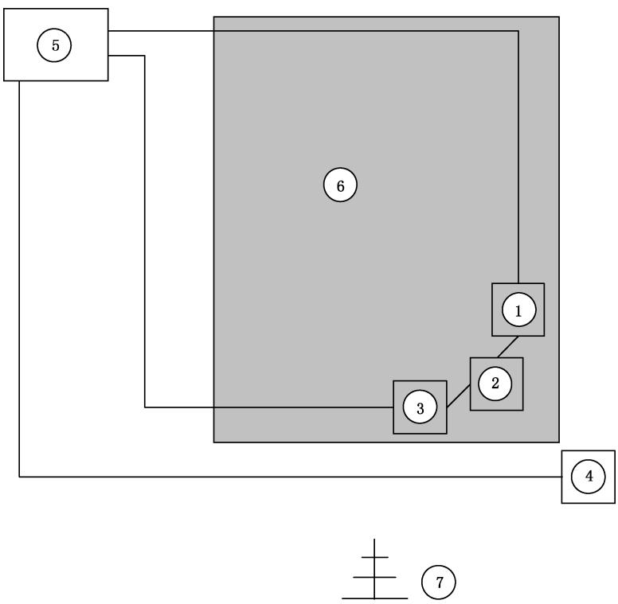

标引序号说明：

①——手术附件；

②——负载；

③——中性电极或浸盐海绵；

④——脚踏开关；

⑤——高频手术设备；

⑥——不导电台板；

⑦——天线——10 m 距离，垂直极性。

图 BB.1 电场发射试验布置

##### BB.3.3.2 磁场测量

一块置于地平面上方 $1\mathrm{m}$ 的不导电台板用来安置被试高频手术设备的附件电缆，布置如图BB.2所示。

记录在 $10\mathrm{kHz}\sim 30\mathrm{MHz}$ 范围内出现的峰值或准峰值。

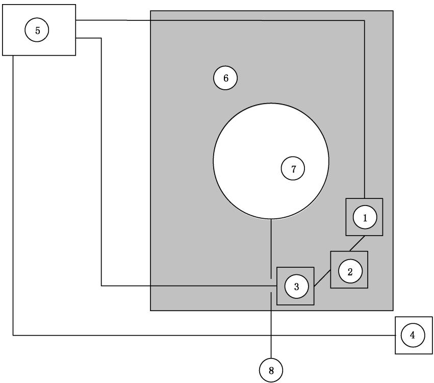

标引序号说明：

①——手术附件；

②——负载；

③——中性电极或浸盐海绵；

④——脚踏开关；

⑤——高频手术设备；

⑥——不导电台板；

⑦——天线；

⑧——连接到测量设备的电缆。

图 BB.2 磁场发射试验布置

##### BB.3.3.3 网电源传导测量

一只置于地平面上方 $1\mathrm{m}$ 的不导电台板用来安置被试高频手术设备的附件电缆，布置如图BB.3所示。

记录在 $150\mathrm{kHz}\sim 30\mathrm{MHz}$ 之间出现的峰值或准峰值。

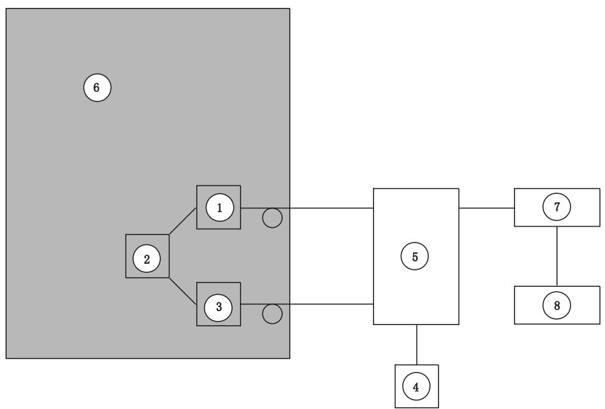

标引序号说明：

①——手术附件；

②——负载；

③——中性电极或浸盐海绵；

④——脚踏开关；

⑤——高频手术设备；

⑥——不导电台板；

⑦——测试设备；

⑧——分析仪。

图 BB.3 传导发射试验布置

#### BB.3.4 数据汇总

##### BB.3.4.1 电场发射

典型的，在 50 MHz 以下出现最大值，在较高频率下，能量降低。在所有频率下拉弧使能量增加，对金属拉弧是最恶劣的临床环境。

##### BB.3.4.2 磁场发射

典型的，在高频手术设备工作频率下产生最大值，在整数倍工作频率下具有附加峰值。在所有频率下拉弧会增加能量，对金属拉弧是最恶劣的临床环境。

##### BB.3.4.3 网电源传导发射

典型的，在高频手术设备工作频率下产生最大值，在整数倍工作频率下具有附加峰值。在所有频率下拉弧会增加能量，对金属拉弧是最恶劣的临床环境。

##### BB.3.4.4 高频手术设备的最大发射电平

火花隙设备产生的发射电平最高，这种形式的高频手术设备尽管长久未见销售，但在一些医院仍可找到。它们由于具有非常高的输出电压和使用间隙放电来产生凝波形，因而可引起最恶劣的电磁骚扰（EMD）环境，使用火花隙导致高频下产生高得多的发射电平，最恶劣情况发射值见表BB.1和表BB.2。电场测量距离为 $10\mathrm{m}$。

**表 BB.1 火花隙型高频手术设备最恶劣情况发射值**

| 发射类型   | 不拉弧                   | 对盐水拉弧               | 对金属拉弧               |
| ---------- | ------------------------ | ------------------------ | ------------------------ |
| 电场       | 92 dBμV/m（40 mV/m）    | 80 dBμV/m（10 mV/m）    | 95 dBμV/m（56 mV/m）    |
| 磁场       | 96.47 dBμA/m（67 mA/m） | 99.47 dBμA/m（94 mA/m） | 96.47 dBμA/m（67 mA/m） |
| 网电源传导 | 117 dBμV（708 mV）      | 未测量                   | 未测量                   |

**表 BB.2 非火花隙型（现代）高频手术设备最恶劣情况发射值**

| 发射类型   | 不拉弧                    | 对盐水拉弧                | 对金属拉弧                |
| ---------- | ------------------------- | ------------------------- | ------------------------- |
| 电场       | 78 dBμV/m（8 mV/m）      | 77 dBμV/m（7 mV/m）      | 83 dBμV/m（14 mV/m）     |
| 磁场       | 61.47 dBμA/m（1.1 mA/m） | 63.47 dBμA/m（1.5 mA/m） | 62.47 dBμA/m（1.3 mA/m） |
| 网电源传导 | 97 dBμV（71 mV）         | 未测量                    | 100 dBμV（100 mV）       |

### BB.4 建议的试验

**BB.4.1** 下面的资料描述一些特定试验，它们被设备制造商用来确定他们的产品是否能承受高频手术设备产生的发射。这些试验只预期作为指南使用，可根据设备与高频手术设备的位置配放作一些调整。下面的试验设计用于模拟紧挨高频手术设备放置（外壳和电缆）的两类设备。正如 YY 9706.102—2021 所述，设备制造商可以在试验前决定对这个试验的什么响应是可接受的。

**BB.4.2** 布置待试设备，将单极高频附件电缆至少绕两圈在待试设备上，如图 BB.4 所示。

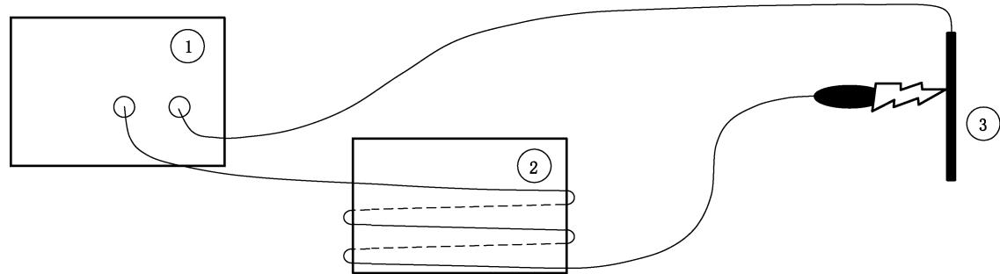

标引序号说明：

①——高频手术设备；

②——待试设备；

③——金属板。

图 BB.4 设备特定试验

用一根电缆（线），其一端接到高频手术设备的中性电极连接器（机上插孔）上，另一端接到一块金属板上，让高频手术设备在每一个可用的输出模式下启动并使单极高频附件对金属板拉弧。对于每一个输出模式，调整高频手术设备设定以产生最高的峰值输出电压。

这个试验要在可能的最大频率范围内产生强电场和强磁场。

**BB.4.3** 使单极高频附件同金属板（接触）短路（不是拉弧），重复 BB.4.2 试验。高频手术设备要对每一

个输出模式调节到最大输出功率。

这个试验可产生最大输出电流，因此产生最强的磁场，在工作频率下这个试验可产生较强电场。

**BB.4.4** 将单极高频附件电缆如图 BB.5 那样绕在待试设备网电源电缆上，重复进行 BB.4.2 和 BB.4.3 试验。

这个试验是为了模拟经网电源电缆耦合进设备的噪声。

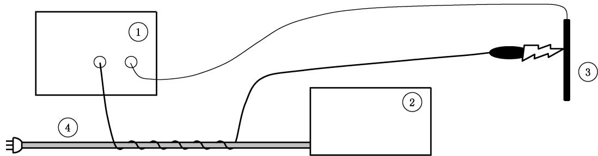

标引序号说明：

①——高频手术设备；

②——待试设备；

③——金属板；

④——待试设备网电源电缆。

图 BB.5 电源电缆特定试验

**BB.4.5** 如果设备有电缆进入消毒部位，这些电缆和单极高频附件电缆之间也会出现耦合。为了试验这种可能性，可将单极高频附件电缆如图 BB.6 绕在待试设备附件电缆上，重复 BB.4.2 和 BB.4.3 试验。

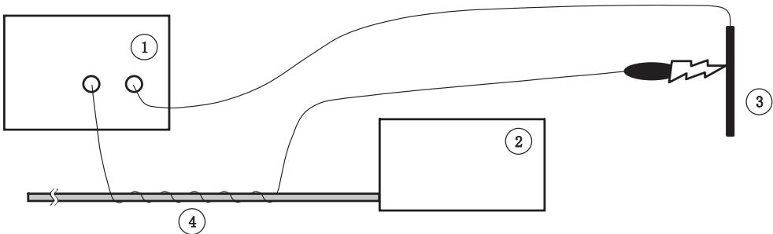

标引序号说明：

①——高频手术设备；

②——待试设备；

③——金属板；

④——待试设备的附件电缆。

图 BB.6 附件电缆特定试验

**BB.4.6** 为了确定经患者传导的发射影响，可根据待试设备与患者的耦合程度对试验作较大调整。要求读者查阅相关设备的专用标准以获得更多信息，许多专用标准早就包含了这种试验。

## 参考文献

[1] GB/T 4208 外壳防护等级（IP代码）

[2] GB 9706.218 医用电气设备 第2-18部分：内窥镜设备的基本安全和基本性能专用要求

[3] GB/T 17626.3—2016 电磁兼容 试验和测量技术 射频电磁场辐射抗扰度试验

[4] GB/T 17626.6—2017 电磁兼容 试验和测量技术 射频场感应的传导骚扰抗扰度

[5] IEC 60601-2-4:2010 Medical electrical equipment—Part 2-4: Particular requirements for the basic safety and essential performance of cardiac defibrillators

[6] IEC 60601-2-34:2011 Medical electrical equipment—Part 2-34: Particular requirements for the basic safety and essential performance of invasive blood pressure monitoring equipment

[7] CISPR 11 Industrial, scientific and medical equipment—Radio-frequency disturbance characteristics—Limits and methods of measurement

[8] ANSI/AAMI HF18:2001 Electrosurgical Devices

[9] CENELEC Guide 29:2007 Temperatures of hot surfaces likely to be touched

[10] NESSLER N., REISCHER W., SALCHNER M. Measurement Science Review, 2003, Volume 3, Section 2.

[11] NESSLER N. Current Density distribution in Human skin under the Grounding electrode of Electrosurgery, BEMS 17 $^{th}$ Annual Meeting, Boston, MA., 1995.

[12] NESSLER N., HUTER H., WANG L. Sicherheitstester für HF-Chirurgie-Neutralelektroden. Biomedizinische Technik, 1993, Volume 38, pp 5-9.

[13] NESSLER N. REISCHER W., SALCHNER M. Electronic Skin—Test Device For Electrosurgical Electrodes. 12 $^{th}$ IMEKO TC4 International Symposium, Zagreb 2002.

[14] NESSLER N., Salchner M., Electrosurgery: CQM-Simulation without Volunteers, Biomed Tech 2012;57(Suppl1), DOI 10.1515/bmt-2012-4205, p208-211, 2012.

[15] KELLER A., ROSENFELDER G. "DIN EN 60601-2-2, 4th edition, clause 59.103.5 /59.104.4-comparison of alternative test methods-leakage current test method versus capacitance test method", Aesculap AG & Co. KG, 25-Aug-05.

[16] KÖNIG A., HEINRICH M. Comparative test of HF leakage current on cables with different measuring methods. BOWA Electronic, 11.03.05.

[17] EMERGENCY CARE RESEARCH INSTITUTE. Clinical studies. Health Devices, 1973, volume 2, numbers 8-9, pp.194-195.

[18] EMERGENCY CARE RESEARCH INSTITUTE. Draft Environmental Requirements and Test Methods for Non-Implantable Medical Devices (Contract No. FDA-74-230). Plymouth Meeting, PA: ECRI, July 1978.

[19] EMERGENCY CARE RESEARCH INSTITUTE. Development of Environmental Test Methods for Non-Implantable Medical Devices, Final Report (Contract No. 223-77-5035). Plymouth Meeting, PA: ECRI, April 1979.

[20] MORITZ, AR, HENRIQUES, FC. Studies in thermal injury: II. The relative importance of time and surface temperature in the causation of cutaneous burns. American Journal of Pathology, 1947, volume 23, number 5, pp.695-720.

[21] PEARCE, JA, FOSTER, KS, MULLIKIN, JC, GEDDES, LA. Investigations and Studies on Electrosurgery, (HHS publication FDA 84-4186). Rockville, MD: U. S. Food and Drug Administration, 1981.

[22] PEARCE, JA, GEDDES, LA, VAN VLEET, JF, FOSTER, K, ALLEN, J. Skin burns from electrosurgical current. Medical Instrumentation, 1983, volume 17, number 3, pp. 225-231.
